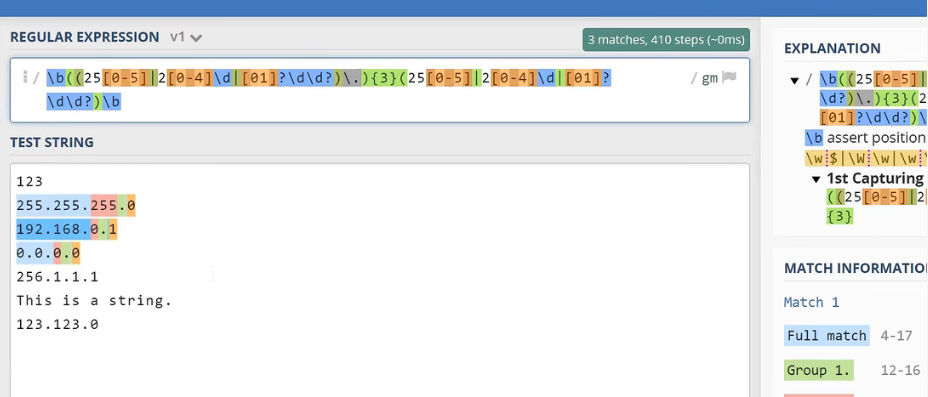
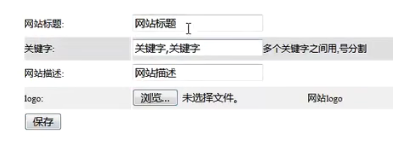
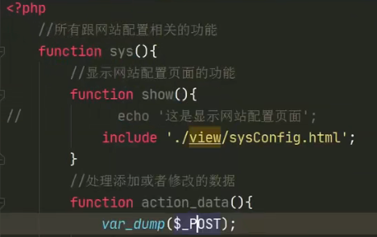
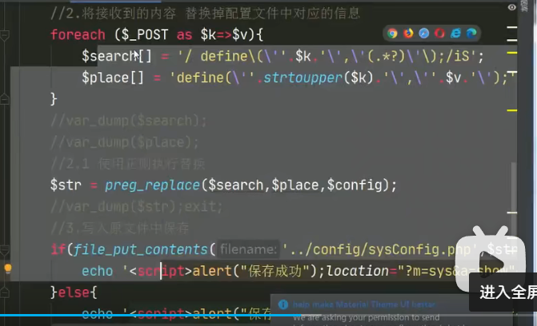

- [代码逻辑](#代码逻辑1)

# WEB工作原理架构


# CMS系统架构

### 整个流程构架：

> 1.需求分析
>
> ​	CMS
>
> ​			后台：会员模块、分类模块、文章模块...
>
> ​			前台：首页、列表页、文章列表、搜索、分页、注册、登录页....
>
> 2.数据库设计
>
> ​			1.找实体
>
> ​			2.为实体找属性
>
> ​			3.找关系
>
> ​			4.E-R图
>
> 3.程序设计
>
> ​		项目的目录结构（MVC设计模式）
>
> ​					一、EW-cms（主目录）
>
> ​							1.admin 网站后台目录（
>
> ​								layout-后台公共模板文件-header.html/left.html；
>
> ​								include-后台资源目录-css/js/img；								
>
> ​								
>
> ​								view-所有的目录user/type-index.html/index.php-访问后台的入口文件-所有后台函数的调用-所有路径的include的蛊王；；
>
> ​								control控制器目录
>
> ​										IndexControl.php显示后台主页文件-一些函数的具体编写/UserControl.php用户相										关操作/ORG扩展目录
>
> ​								）
>
> ​							2.web（home）  网站前台目录（
>
> ​								index.html 首页
>
> ​								layout 前台工作模板 header/footer
>
> ​								model模块（存放php与mysql相连的增删改查操作的函数封装）
>
> ​								view-每个页面都有单独的文件(index.php前台主入口文件)
>
> ​								control-每个页面相关的操作写入到对应的control文件中）
>
> 
>
> ​							4.public 公共资源目录（图片上传和缩放/index.php 网站（项目）主入口文件）
>
> ​							5.config 网站的配置（数据库相关的操作、数据库的配置文件、数据的验证、上图中的model-设置网站配置常量）
>
> 5.项目测试
>
> 6.验收完工 项目正式上线

项目的以上在此下面两本书中会说明清楚：

- 程序设计说明书

  > 一、引言（编写目的、背景、定义、参考资料）
  >
  > 二、外部设计（标识符和状态、使用它的程序、约定、支持软件）
  >
  > 三、结构设计（概念结构设计（实体、属性、E-R图绘制）、逻辑结构设计（E-R图转向关系模型、确定关系模型）物理结构设计（数据表的设计、创建数据表、数据库的设计和其他问题））
  >
  > 

- 项目需求分析说明书

  > 一、文档介绍（编写说明、项目背景、适用人员、参考资料、术语的缩写与解释）
  >
  > 二、任务概述（产品描述、系统目标（前后台）、系统功能结构、系统流程图）
  >
  > 三、业务描述（后台登录管理（功能构成、描述、预览）、文章管理、图片管理、栏目管理、用户组管理）
  >
  > 最多
  >
  > 四、系统运行环境（硬件环境、软件环境）
  >
  > 五、需求设计评审

# 项目目录搭建和后台模板调用

- 目录路径

  > `../include/css/header.css`   在上级目录下找css
  >
  > `css/header.css`   在当前目录下找css
  >
  > `./include/css/header.css`   在同级目录下找css

- ### php基本语法查询A

  > [PHP 语法 | 菜鸟教程 (runoob.com)](https://www.runoob.com/php/php-syntax.html)
  >
  > > - 变量以`$`开头
  > > - 输出为`echo`
  > > - 预定义变量`$_`开头
  >
  > > - 双问号（??）运算符：称为Null合并运算符。若为null则返回"??"后面的值，否则返回原值
  >
  > > - 问号（？）：传参
  > >
  > >   ```html
  > >   <a href="./index.php?m=sys&a=show>网站配置</a>
  > >   ```
  >
  > > - html语法之嵌入css样式
  > >
  > >   ```php+HTML
  > >   //html中的head里
  > >   <link rel=“  ” href="css文件的目录路径">
  > >   ```
  >
  > > - **$_GET变量用法**
  > >
  > >   <a name="$_GET变量笔记"></a>
  > >
  > >   [$_POST变量笔记详情见上个大标题下php基本语法查询B中](#$_POST)
  > >
  > >   
  > >
  > >   ```php+HTML
  > >   //welcome.php 文件里
  > >   <form action="hello.php"method="get">// form 标签提交表单  ；  action表示向什么文件提交（此处也可填提交对象文件的路径并传参赋值）； method表示提交的方法
  > >   Name:<input type="text"name="name">
  > >   Age:<input type="text"name="age">
  > >   <input type="submit">
  > >   </form>
  > >   
  > >   //当用户点击提交按钮时，发送的 URL 会类似这样：http://www.w3school.com.cn/welcome.php?name=Peter&age=37
  > >   
  > >   //“hello.php” 文件现在可以通过 $_GET 变量来获取表单数据了（请注意，表单域的名称会自动成为 $_GET 数组中的 ID 键）
  > >   
  > >   //hello.php 文件里
  > >   Welcome <!--?php echo GET["name"];?-->.<br> 
  > >   You are <!--?php echo $_GET["age"];?--years old!
  > >   ```

- ### php作用概览

  - html和php关系。

    **php是脚本语言**，生成动态html。html收集数据提交给php处理，然后php再把数据返回给html显示

  - **JS和php的区别**

    1、php是一个服务端语言，而JavaScript是一个客户端语言；

    2、**php的字符串连接符是“.”，而JS的是“+”；**

    3、数组相加，php用“+”，JS用concat()函数；

    4、php只有变量名区分大小写，而JS全部区分大小写。

    5、**php核心功能通过函数方法实现**，而js通过对象实现

  - php和mysql的关系

     *php是服务器端脚本语言 mysql是服务器端常见的数据库管理程序.* 一般用**apache+php+mysql**一起使用, 可以实现很多常见操作数据库的网页网站应用。php语言支持对mysql数据库中的数据，进行连接，增，册，查，改，和关闭的操作。

- ### admin（网站后台目录下）文件和模板的调用

  > - 注意 改动时 若a1文件下有写     **include “a2的路径”**，且
  >
  >   若a2文件还要再include “文件路径”，则 
  >
  >   >  此文件路径的查找按照a1文件层次级别的位置查找，
  >
  >   > 此文件路径所指的文件（html）中的css关联的路径也要按a1的文件层次级别查找
  >
  >   > include 包含 即 所有的代码都被赋值粘贴过去。
  >   >
  >   > > 可因此实现html中写php代码（此html文件一定被包含进某一个php文件）
  >   > >
  >   > > 三个header、left、right的html文件的合并（把多余的head和body标签及内容去掉）
  >   >
  
- 大体文件目录
  
  
  
  admin下的文件目录
  
  
  
- admin下，**index.php(后台主入口文件)**
  
  -->在此例中明显可见，所有的路径包含都是以index.php的级别标准查找的。
  
  -->浏览器中，admin下，默认打开的文件，实现函数调用
  
  
  
  - 可调用时**传参**进去（[**此处配置文件的内容编写见下一个大标题**](#后台配置文件内容)）
  
    <a name="后台配置文件调用总览"></a>
  
    ```html
      <a href="./index.php?m=sys&a=show>网站配置</a>
               //此例中，sys和show都是函数
    ```
  
    再在control下新建一个“sysControl.php”写sys和show函数，函数里包含新写的sysControl.html文件
  
    在index.php里把“sysControl.php”包含进去，且**index.php其他参数不用改**，便可实现传参的调用。
  
    
  
- admin下，contrl下，**indexcontrol.php文件**
  
  -->写所有将被用到的函数和方法的具体“定义”
  
  
  
- admin下，view下，**index.html文件**
  
  -->写具体要呈现的内容
  
  
  
- layout文件夹包含：header.html和left.html文件

# 后台网站配置功能的实现

- ### php基本语法查询B

  > pass
  >
  > > - PHP的变量在HTML的`input`表情里的`value`属性里面写时的写法：`<?=变量名?>`
  > >
  > > - 数组的写入
  > >
  > >   
  > >
  > >   
  >
  > > - php中退出执行代码为`exit`
  > > - php中`变量不需要定义`，直接写名字直接用就行了-->弱类型语言
  > > - php中**字符串的连接与分割**`.`和`'`。即`'.'`的使用
  > > - php中，输出为`echo`
  > > - php中，**变量名以美元符号开头**
  >
  > > - `var_dump(x)`函数:用于输出变量x的相关信息。
  > >
  > >   x经常是一个**预定义的数组变量或者对象**。
  >
  > > - `define(name,value,case_insensitive)`函数：定义一个常量值，常用在配置文件中。
  > >
  > >   名字、值、对名字的大小写是否敏感（true为不敏感，false反之）
  >
  > > - html语法之`form`标签
  > >
  > >   <a name="图片和文本上传代码"></a>
  > >
  > >   能让用户输入内容都在form表单范围内。
  > >
  > >   特别说明属性method。method="post" 或者 method=“get”两种请求方法
  > >
  > >   `input`标签（`type` 和`name`属性）必须存在于`form`里
  > >
  > >   `textarea`(`name`属性、行和列)标签必须存在于`form`里，表示多行文本的输入。
  > >
  > >   `span` **用于对文档中的行内元素进行组合**。(用于提示、文本样式需要有特殊变化时)
  > >
  > >   `td`（单元格中）的属性`colspan`表示可限定单元格所占的列数，即跨列合并
  > >
  > >   此处`form`标签包含了`table`标签包含了`tr`标签包含了`td`标签
  > >
  > >   以下为图片文件上传的例子（adimin下view下sysConfig.html中）:
  > >
  > >   
  > >
  > >   只要有图片上传，就要改变form的编码格式`enctype`（sysConfig.html中）：
  > >
  > >   enctype属性指定将数据发回到服务器时浏览器使用的编码类型。
  > >
  > >   
  > >   
  > >   以下为普通文本输入的例子（sysConfig.html中）：
  > >   
  > >   
  >
  > > - **`$_POST`变量**
  > >
  > >   <a name="$_POST"></a>
  > >
  > >   （[**$_GET变量笔记详情见上个大标题下php基本语法查询A中的**](#$_GET变量笔记)）
  > >
  > >   由于变量不显示在 URL 中，所以无法把页面加入书签。
  > >
  > >   
  > >
  > >   ```php+HTML
  > >   //form.html中
  > >   <html>
  > >   <head>
  > >   <meta charset="utf-8">
  > >   <title>菜鸟教程(runoob.com)</title>
  > >   </head>
  > >   <body>
  > >   
  > >   <form action="welcome.php" method="post">
  > >   名字: <input type="text" name="fname">
  > >   年龄: <input type="text" name="age">
  > >   <input type="submit" value="提交">
  > >   </form>
  > >   
  > >   </body>
  > >   </html>
  > >   
  > >   
  > >   //welcome.php中：
  > >   //"welcome.php" 文件现在可以通过 $_POST 变量来收集表单数据了（请注意，表单域的名称会动成为 $_POST 数组中的键）
  > >   欢迎 <?php echo $_POST["fname"]; ?>!<br>
  > >   你的年龄是 <?php echo $_POST["age"]; ?>  岁。
  > >   
  > >   //此时，显示收集结果的URL：http://www.runoob.com/welcome.php
  > >   
  > >   ```
  >
  > > - **`$_FILES`变量**
  > >
  > >   在php中，`$_FILES`是一个预定义的数组变量，用来获取通过POST方式上传到服务器的文件数据。如果为单个文件上传，那么`$_FILES`为二维数组；如果为多个文件上传，那么`$_FILES`为二维数组。
  >
  > > - `file_get_contents(filename:"xxxx")`函数
  > >
  > >   作用是将整个文件读入一个字符串。括号里填写所要读取文件的路径。"filename:"可写可不写。
  > >
  > >   该函数是二进制安全的。（意思是二进制数据（如图像）和字符数据都可以使用此函数写入。）
  > >   
  > > - `file_put_contents(filename:"xxxx",字符串变量)`函数
  > >
  > >   作用是把字符串变量传到filename文件里，传入成功返回1，否则返回0。
  >
  > > - `foreach()`数组的历遍函数
  > >
  > >   ```php
  > >   $b = array('a'=>'Tom','b'=>'Mary','c'=>'Peter','d'=>'Jack');
  > >   foreach ($b as $value) {
  > >     echo $value."<br/>";
  > >   }
  > >   //结果：
  > >   Tom
  > >   Mary
  > >   Peter
  > >   Jack
  > >       
  > >   foreach ($b as $key => $value) {
  > >     echo $key.','.$value."<br/>";
  > >   }
  > >   //结果：
  > >   a,Tom
  > >   b,Mary
  > >   c,Peter
  > >   d,Jack
  > >   ```
  > >
  
- ### 正则表达式

  > [正则表达式匹配网站](https://regex101.com/)
  >
  > > - 限定符
  > >
  > >   > `?`     例如`used?`表示 前一个字符d可由可无
  > >   >
  > >   > ​		匹配结果 use  used；
  > >   >
  > >   > `*`		例如`ab*c`表示前一个字符b出现次数不定
  > >   >
  > >   > ​		匹配结果 abbbbc ，  abc  ， ac；
  > >   >
  > >   > `+`        例如`ab+c`表示前一个字符匹配次数1此或者多次
  > >   >
  > >   > ​			匹配结果 abbbbc ， abc；
  > >   >
  > >   > `{n,m}`	限定匹配次数表示最少匹配n个，最多匹配m个
  > >   >
  > >   > - 如果要匹配的是一个字符串,用括号括起来：`（ab）+`
  > >
  > > - 运算符
  > >
  > >   > `|`       或者or运算符，例如`a (cat|dog)`（注意一定要有括号）
  > >   >
  > >   > ​			匹配结果：a cat，a dog
  > >
  > > - 字符类**(`+`符号是因为匹配时加上去的，不属于字符本身)**
  > >
  > >   > `[abc]+ `    方括号内的字符串表示只要包含这几个字符就匹配
  > >   >
  > >   > `[a-zA-Z]+`  表示匹配所有的大写字符和小写字符
  > >   >
  > >   > `[^0-9]+  ` 表示除了所有的数字字符其他的都匹配
  > >
  > > - 元字符(**(`+`符号是因为匹配时加上去的，不属于字符本身**)
  > >
  > >   > `\d+`  匹配所有的数字字符
  > >   >
  > >   > `\D+`    与上面小写d相反
  > >   >
  > >   > `\w+`  匹配所有的单词字符（英文、数字、下划线）
  > >   >
  > >   > `\W+`  与上面小写的相反
  > >   >
  > >   > `\s+`  匹配所有的空白字符（tab键和换行符）
  > >   >
  > >   > `.*`    匹配任意字符（除了换行符）
  > >   >
  > >   > `^a`	匹配所有行首的a
  > >   >
  > >   > `a$`	匹配所有行尾的a
  > >   >
  > >   > `\b`   表示单词字符的边界结束了（末尾）
  >
  > **贪婪与懒惰匹配**
  >
  > - 加一个`?`让**默认的贪婪匹配**-->(转为)懒惰匹配
  >
  >   
  >
  >   
  >
  > - 实例1（颜色值十六进制的匹配）
  >
  >   
  >
  > - 实例2（ipv4地址的匹配）
  >
  >   
  >
  > - fore-learning
  >   - 正则表达式30分钟入门教程作者：deerchao
  >     https://deerchao.cn/tutorials/regex/regex.htm
  >   - Regex tutorial一A quick cheatsheet by examples（英文）作者：Jonny Fox
  >     https://medium.com/factory-mind/regex-tutorial-a-simple-cheatsheet-by-examples-649dc1c3f285
  >   - Regular Expressions Tutorial（英文）
  >     https://www.regular-expressions.info/tutorial.html


### php中用正则表达式

> [(71条消息) PHP正则表达式_正在过坎的博客-CSDN博客_php正则表达式](https://blog.csdn.net/weixin_46601374/article/details/122310702)
>
> - **实例:要实现接受到的内容实现替换**
>
>   `(`要进行转义;
>
>   变量和字符串之间的分割与拼接用`'.'`;
>
>   修饰符写在末尾。`i`代表不区分大小写`S`代表匹配一切字符；
>
>   <a name="Q2"></a>
>
>   我们都使用正斜线` //` 作为正则表达式的定界符号;
>
>   
>
>   
>
>   
>
>   > - 关键字（概览）
>   >
>   > > `()`     表示一个整体
>   > >
>   > > `^`      表示输入字符串的开始位置
>   > >
>   > > `$ `    表示输入字符串的结束位置
>   > >
>   > > `. `       通配符，代表任意字符,但不匹配换行
>   > >
>   > > `\ `         转义字符
>   > >
>   > > `|`		两项之间的一个选择
>   >
>   > - 修饰符
>   >
>   > > `i`     表示不区分大小写
>   > >
>   > > `s`     s 表示.将匹配一切字符
>   > >
>   > > `x`     表示匹配到空白字符会忽略
>   > >
>   > > `A`     表示匹配规则要从头开始匹配
>   >
>   > - 常用函数
>   >
>   > > **Preg_match_all(正则表达式、匹配字符串、匹配到的东西放入数组)**
>   > >
>   > > 该函数会返回匹配到的次数（可能是0），	或者如果发生错误返回FALSE
>   >
>   > > **preg_replace(正则表达式、替换成什么、匹配字符串)**
>   > >
>   > > 该函数会返回替换后的结果

- ### 后台网站配置文件的内容编写：

  ([后台配置文件调用总览详情见前一大标题](#后台配置文件调用总览))

  <a name="后台配置文件内容"></a>

  **目的：**

  传入保存操作，实现用户输入的东西变为整个网站的名字、logo、关键字等等。即更新（更改）配置文件中的常量。

  **流程概览：**

  **sysControl.html**写实现修改这个操作的**前端页面和获取用户输入**；**sysConto.php**写**实现修改这个操作**的具体代码。（把从sysControl.html中接受到的用户输入的数据进行操作）。

  **sysConfig.php**中写配置的键值对，由于用户输入的这些东西（**指文本形式的内容保存**）是需要保存并在后续应用的，所以需要一个配置文件来保存。

  **upload_func.php**是**图片（文件）上传函数**，因为在sysControl.html中`POST`方法只能传`“text”`类型，`“file”`类型直接传不了。用此传过以后，拿**upload文件**来保存（**指文件形式的内容保存**）

  - **sysControl.html**中写完基本要实现的页面内容，直接展示：(部分代码见前面的php基本语法查询B)

  

  

  ​       此处`form`提交表单中，**用`post`方法**，提交进去的目             	   标文件在`action`属性里写，并传参。 

  ​      `sys`和`action_data`都是函数名。

  ​      **此处用的post只能接受到所有填入文本的信息而上载     	  的图片信息接受不到。故图片的上载只能再通`$_FILES   		预定变量来显示。**（因为图片上传时用的type=“file”）

  ​        [图片和文本上传代码](#图片和文本上传代码)

  ​        <a herf="Q1"></a>  

  

  - **sysControl.php里**：

    

    更新：

    

    包含进来就可以改value了：

    

    由于有没有文件上传(为不为空)能影响后台表单接受到的数据要三行还是四行，所以用以下**代码逻辑**来消除此两种情况的影响：
    
    上载的图片在upload_func.php里已永久保存至文件夹。
    
    <a name="代码逻辑1"></a>
    
    
    
    此时的post下已经包含图片信息（原本3个，现在变成4个了）：
    
    
    
    用正则表达式进行替换。把用户写入的需要永久保存的文字信息写入**sysConfig.php文件**。并反馈出结果是否保存成功。PHP里写HTML直接开始写标签，`script`标签里的`location`属性表示在页面中
    
    

  

  - admin下，org下（其实也可放在public里），图片上传函数文件**upload_func.php**，把上传的图片放入**upload文件夹**下。

    此函数表示只需要传入表单的名称+需要上传的目的路径。返回的是一个字符串。

    

  - config下，**sysConfig.php**文件

    里面写需要用户传入保存的几个常量。

    

# 前台关联后台与配置文件

**目的：让我们后台所更改的配置文件的内容在前台中显示出来。设置系统的配置文件内容自由添加**

- 目录搭建（后台怎么写 前台就则怎么写）

  一样的文件目录、一样的home下的indexControl.php（写函数,包含main.html、**包含配置文件sysConfig.php**）、index.php（前台主入口文件，包含indexControl.php）、main.html（用php实现包含进header.html、foot.html）

  注意：**包含了配置文件之后就可以在html标签中把值替换成配置文件中的常量了**。

- 遗忘回顾链接

  [3.后台网站配置功能实现_哔哩哔哩_bilibili](https://www.bilibili.com/video/BV1f64y1Z71f?p=3&vd_source=95bb0747454a6847ca940e34f9be508c)

​       p3   48分开始，前台配置写的方法和整体流程回顾

### PHP（和HTML)基本语法查询C

> - `meta`标签（写在`head`标签里，表示显示网页的一些信息）
>
>   <meta> 标签提供了 HTML 文档的元数据。元数据不会显示在客户端，但是会被浏览器解析。
>   
>   ```html
>   <meta name="keywords"content="HTML,ASP,PHP,SQL">
>   ```

# 总结

- 为什么要这么复杂的写这个CMS系统和配置文件？

  --看起来更加简单，我们作为**管理员管理网站的时候**就可以在后台的可视化的html界面中改，**不用去找源代码才能实现网站配置内容的更改。**

  --更改起来更加方便，因为是单独把配置保存到一个配置文件里的，所以我们不仅可以手动修改这个文件，也可以在后台的html页面中改。

- 重点掌握的内容

  - 文件目录的架构（admin下、home下、view下、config下、public下）
  - 正则表达式的匹配和替换
  - php写在html中的作用。include包含，php传参与函数、html基本标签。
  - 具体cms配置功能的写法（前后台）
  
  

# 疑问

[【1】](#Q1)POST方法，不能接受到用户进行图片上载的图片信息？？

猜测是因为上传的图片一个（名字自定义）就带有多个属性名字；而普通的文本信息只有一个属性即自定义的名字。

[【2】](#Q2)php中写正则的时候，修饰符`s`(匹配一切字符)和关键字`.`(代表任意字符的区别)？？

猜测虽然表达的意思差不多。但一个时修饰作用（形容词），一个是代表作用（名词）


