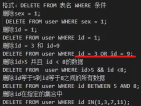
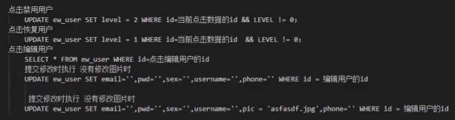
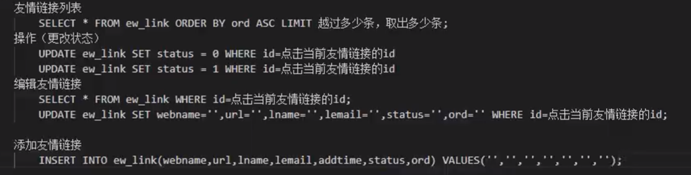

# MySQL导论

- MySQL是一个**关系型数据库管理系统**（RDBMS）,由Oracle企业支持，SQL是它的，开源免费。存储引擎多变，不支持查询取消。

  [sqlserver和mysql区别有哪些-mysql教程-PHP中文网](https://m.php.cn/article/414005.html)

- 如何配置安装启动

- **phpMyadmin**

  > phpMyAdmin是一个以PHP为基础,以Web-Base方式架构在网站主机上的MySQL的**数据库管理工具**,是免费的Web应用程序;为使用MySQL数据库管理系统提供了方便的**GUI**,让管理者可用Web接口管理MySQL数据库 
  >
  > > 访问：localhost/admin

### CMD与MySQL

> 基础符号
>
> > **登录mysql**：`mysql[-h 数据库服务器地址（如果存在本机可不写）-u 用户名 -p 密码吗]`
> >
> > 退出mysql：`\q`
> >
> > ​						`exit`
> >
> > ​						`quit`
> >
> > 用完整格式查看 `\G`
> >
> > 命令执行符（一条语句的结束） ` ;` 或者 `\g`
> >
> > 清除信息                                         `\c`
>
> > 常见符号：`->`    当前命令没有命令执行符。
> >
> > ​					`'>`    前面写的SQL语句缺少单引号


### 编码规范

- **关键字和函数要全部大写**

- 数据库名、表名、字段名 **全部小写**

- 必须以**`;`结尾**（命令执行符确认）

- 常见的中文**字符集**设置

  - 需要设置`utf8-mb4`,否则将乱码

    > `utf8`	国际化标准，亚洲通用字符集，一个汉字占3个字节（1~4字节的编码）
    >
    > `GBK`     中期标准，一个汉字占2个字节
    >
    > `GB2312`  早期标准

  - 数据库字符集的依赖关系（逐层查找）

    > 内容字符集->字段字符集->表字符集->库字符集


# SQL语句

我们每输入一条命令，所跳出来的返回值很重要。命令要简洁，效率优先，能不麻烦就不麻烦。 

- 分类

  > DDL 数据库定义语言（CREAT DROP SHOW ALTER）
  >
  > DML 数据库操作语言（INSERT DELETE UPDATE)
  >
  > DQL 数据库查询语言（SELECT WHERE）
  >
  > DCL 数据库控制语言（权限）

- 系统默认数据库

  最好不要动。

  > information_schema	保存列行表单对象信息
  >
  > mysql								保存服务器运行信息
  >
  > performance_schema	保存历史记录信息
  >
  > sys										类帮助文档

### 对库的操作

- **创建**一个数据库`CREATE DATABASE 库名`

  - `CREATE DATABASE IF NOT EXISTS 库名 `	如果不存在此库，则执行创建操作

    > 最好不要在MySQL里写判断语句。**判断等逻辑语句在PHP里写就好。**

- **修改**一个数据库

  - 没有提供数据库名的修改命令，**数据库名一旦创建不能修改**。

- **删除**一个数据库`DROP DATABASE 库名` 

  - `DROP DATABASE IF NOT EXISTS 库名 `

- **查询**数据库

  - 查询**所有的**库名`SHOW DATABASE`	

  - **选择进入**一个数据库`USE 库名`

- 关于库的**字符集的查看和修改**

  - 查询新创建的库所用的字符集

    `SHOW CREATE DATABASE 库名`

  - **修改一个库的字符集**

    `ALTER DATABASE 库名 CHARSET 字符集名`

### 对表的操作

- 查看**所有**表 `SHOW TABLES`(需要进入到那一个数据库中)

- 创建一个表

  ```sql
  CREAT TABLE 表名(
  
  字段名（行名） 数据类型 列的完整性约束;
  - - -
  
  )[ENGINE=MYISAM DEFAULT CHARSET=UTF8MB4]
  ```

  - 实例

    

- **查询**表

  - 查询**一个表**内容

    `DESC 表名`返回的是这个整张表的具体信息。

  - 查询一个表的**创建信息**

    `SHOW CREATE TABLE`

- **备份**表

  `CREAT TABLE 要备份的表名 SELECT * FROM 原表名`

- **修改**一个表的**表名**

  `ALTER TABLE 表名 RENAME 新表名`

- **删除表**

  - 删除一张表`DROP TABLE [IF EXISTS] 表名`
  - 删除多张数据表`DROP TABLE 表名1，表名2`


### 对字段的操作

- 添加一个数据字段

  `ALTER TABLE 表名 ADD 新字段名 [列的完整性约束][位置参数]`

  - 位置参数：
    - 不写默认为在末尾插入
    - `FIRST`在表的第一行插入
    - `AFTER 字段列名` 在某一字段行的之后插入
  
- **修改一个数据字段**

  - `ALTER TABLE 表名 MODIFY 字段名 字段类型 [列的完整性约束]`

    注意：使用`MODIFY`关键字，**只能修改此字段的内容**。

  - `ALTER TABLE 表名 CHANGE 新字段名 新字段类型 [列的完整性约束]`

    注意：使用`CHANGE`关键字，可以更改字段名，**但必须连着后面的也要再写一遍**。

- 删除字段

  - `ALTER TABLE 表名 DROP 字段名`

  - `ALTER TABLE 表名 DROP 字段名1，DROP 字段名2；`

- 查询字段

  `DESC 表名`

#### 字段约束

- **只能用于数值类型**

  > - `UNSIGNED`	更改为**无符号**类型。（默认为有符号）
  > - `ZEROFILL`     在数值之前**自动用0补充**不足位。
  > - `AUTO_INCREMENT`    设置**自动增量**（如每行递增加一），若设此量，则**一定要把这个属性设为主键**

- `PRIMARY KEY`    主键约束

  每张表中只能存在一个主键，起着唯一标识的作用。

- `NULL`和`NOT NULL `

  若默认值为`NOT NULL`，则必须要在此字段中插入值。

- `DEFAULT`     指定默认值

#### 基础数据类型约束


> 跟钱相关的一般采用DESIMAL类型，这样会更精确


> 非常也不常见。


> > 字符串：新版本，**一个汉字占用一个字节**。
> >
> > **定长**字符串 ：空白的自动占位存储，好查询，占空间。
> >
> > **变长**字符串：空白的不存储，查询可视困难，不占空间
>
> > `BLOB`:   此类型可以以二进制的数来存储图片。

- 一些关于类型的常识语法
  - MySQL中**默认存储带符号值类型的**。（如果这个类型包含正负的话）
  - `float(6,2)`  表示最大输入6位，小数保留2位。

### （最重要）对内容进行操作

- **添加**数据内容

  - **添加一条（一行）数据**
    
  - 指定表中哪一些字段添加哪一些值
    
    字段名中使用的是反引号`,为了防止关键字报错
    
    value后面的值一一对应
    
      ```sql
      INSERT INTO 表名（`字段名1`,`字段名2`,_）VALUES(`值1`,`值2`);
      ```
    
  - 添加表中所有字段的值
    
    所有值必须按表中顺序一一对应
    
      ```sql
      INSERT INTO 表名 VALUES (`值1`,`值2`,`值3`)
      ```
    
  - 添加**多条**数据：

    

- **修改**数据内容

  `UPDATE 表名 SET 字段名 = 值，字段名=值[修改条件WHERE]`

  所有的修改条件`DELETE`里能用的`UPDATE`里也可以用

- **删除**数据内容

  `DELETE FROM 表名 [删除条件]`

  一定要写删除条件，不然整个数据都被删除了。

  > **WHERE条件**
  >
  > `OR`和`AND`的逻辑
  >
  > `BETWEEN AND`在什么和什么数之间
  >
  > 

- **查询**内容（属于DQL）

  - `SELECT * FROM 表名`

  ​       `*`	表示匹配所有字段

  - `SELECT  字段名1，字段名2，字段名3  FROM 表名`

  - 使用`as`关键字起**别名**：
    `SELECT a.id,a.username,a.age as haha FROM user as a;`

  - 使用`WHERE`进行约束

    `IN`包含和`NOT IN`不包含

    

  - 正则匹配：（万不得已才考虑）
  
    ```sql
    SELECT * FROM user WHERE username REGEXP 'g$';--表示以g结尾
  SELECT * FROM user WHERE username REGEXP ‘^X.+$';
    ```

  - **`LIKE`模糊匹配**

    `%`占位，为任意多个内容

    `_`占位，为任意一个内容

    

    `_`表示任意的**一个**字符

  - `COUNT(字段)`查询个数

    `SELECT COUNT(*) FROM 表名`

    

  - `ASC`（正序），`DESC`倒叙，排序查询

    `SELECT * FROM 表名 ORDER BY 字段 ASC(DESC);`

    

    有顺序`WHERE->ORDER BY->ASC`
  
- `LIMIT`限制查询数量
  
  `SELECT 字段  FROM 表名 [WHERE] [ORDER BY] [LIMIT]`
  
  - `LIMIT 查询数量`
  
- `LIMIT 越过几条，取出几条`
  
- `GROUP BY`分组查询
  
  
  
  `SUM(字段名)`求此字段名的和
  
    `COUNT(字段名)`求此字段名的数量
  
  - `HAVING`效率较低
  
    一般只是使用在分组里面做二次过滤，使用方法和`WHERE`一样。
  
  - **多表联合查询**
  
    `SELECT 表1.字段，表2.字段 FROM 表1，表2 WHERE 表1.字段=表2.字段`
    
    - 做连接查询、右连接查询
  
     

#### 总结

`SELECT 语句 [WHERE条件] [GROUP BY条件][HAVING 条件] [ORDER BY 条件][LIMIT条件]`

**顺序**

### 对内容操作查询数据体系补充

- **限制语句总结**

  - 这些语句可跟在`WHERE`后面，也可跟在`group by`后面

  - `BETWEEN AND`   之间

  - `比较运算符 = > < `   优先级最大

    `NOT`

    `AND`

    `OR`  优先级最小

  - `IN`    `NOT IN`   枚举里面选

  - `LIKE`   `NOT LIKE`   模糊匹配

    占位符`%`   `_`

    可加`ESCAPE '\'`表示定义转义字符（如果需要前面模糊匹配的内容里需要匹配的是转义后的关键字符）

  - `IS NULL`     `IS NOT NULL`

- `GROUP BY`分组查询

  如果写了group by，那么group by

  > 前：只能用聚集函数,或者按什么列分组的那一列。（不能出现其他列）
  >
  > 后：限制条件只能用`having`(不能用`where`)

  - 聚集函数

    `SUM()`  `AVG()`  `COUNT()`  `MAX()`  `MIN()`  

  - `having`和`where`的区别

    > having 作用在group by 分组后，having后才可出现聚集函数
    >
    > where作用于整张表

- `DISTINCT` 

  ```sql
  SELECT DISTINCT 列名 FROM 表名  --把相同的行去掉了
  SELECT COUNT(DISTINCT 列名) FROM 表名 --把相同行去掉的统计数
  ```

- `.`字符链接运算符

  ```sql
  SELECT 列名+' '+'is a'+' '+job
  ```


### 其他查询（除上面单表查询外的）

- 嵌套查询

  - `IN`一般用于不相关子查询这一分类

    ```sql
    --查询选修了课程2的学生姓名
    SELECT sname --外层查询/父查询
    FROM studinfo
    WHERE sno IN 
    (SELECT sno --内层查询/子查询
    FROM sc
    WHERE cno=‘2’)
    ```

  - `EXISTS`一般用于相关子查询这一分类

    ```sql
    查询选修了课程2的学生姓名
    SELECT sname 外层查询/父查询
    FROM studinfo
    WHERE EXISTS 
    (SELECT * 内层查询/子查询
    FROM sc
    WHERE cno=‘2’ AND sno = studinfo.sno)
    
    ```

  - 带有比较运算符的子查询

  - `ANY`（任意值）和`ALL` （所有值）的子查询

    ```sql
    --查询其他系中比IS系某一学生年龄小的学生姓名、年龄（按年龄递减）
    SELECT sname,sage FROM studinfo
    WHERE sage < ANY
    (SELECT sage FROM studinfo
    WHERE sdept =‘IS’)
    AND sdept <>‘IS’
    ORDER BY sage DESC
    ```

- 连接查询

  - 等值连接和非等值连接
  - 自身连接（设`as`别名）
  - （左、右）外连接和内连接
  - 复合条件连接
  - 多表连接后查询

- 集合查询

  - `UNION`并操作

    其两边都是select语句。

    注意：ORDER BY子句只能用于对最终查询结果排序，不能对中间 结果排序，只能出现在最后。

# 编写数据设计说明书及数据表设计

#### 常识

> - **图片存储的数据类型**：char（37）
>
>   因为图片储存都是经过加密的，且返回的字符串永远是32个字节，再加上最长后缀“.jpeg”，就是37字节


#### 流程和设计示例

- 看项目需求报告

- 找实体，找属性，找关系（画E-R图，局部E-R图 --> 整体E-R图）

  全局实例：

  

  局部实例：

  

- 确定关系模式（文字描述，标出主键外键）

- 搭建库-做表（架构）

  实例1：

  

  实例2：

  

  实例3：
  

  - 最后的代码行要指定引擎`ENGINE`和字符集`CHARSET`
  - 设置字符串型的默认值为空字符串`DEFAULT ''`

- 向表中填充数据


# SQL语句的网站应用

### 首页中的SQL语句的应用

- **SQL函数和其他一些基础语句**

  > - `unix_timestamp()`获取当前时间戳
  > - `md5()`密码加密函数
  

  
> - `SHOW WARNING`如果在cmd中报出警告
  > - 一般在建表的时候都会**给所有的字段一个默认值**，因为后续填充数据的时候，不可能每条语句都用到，**没有用到的语句会发出警告**。

- **注册用户：**

  注册即在数据库里插入一条数据。

  ```sql
  INSERT INTO EW_USERS(username,pwd,addtime) VALUES('xiaoming',md5('xiaoming'),获取当前时间戳)
  ```

- **登录**

  登录即在数据库中查询那条数据

  ```sql
  SELECT * FROM ew_user WHERE username='xiaoming' AND pwd=md5('xiaoming')
  ```

- **栏目(层级)查询**

  - 查询顶级栏目

    最顶层的栏目时pid是为0的。

    ```sql
    SELECT * FROM ew_category WHERE pid = 0;
    ```

  - 查询子栏目

    pid表示层级。

    下一层的pid为上一层（其父层）的id

    ```sql
    SELECT * FROM ew_category WHERE pid=(SELECT id FROM ew_category WHERE pid=0);
    ```

  - **最新**文章

    “最新”表示要按时间排序->转为按插入顺序逆序（插入最迟说明最新）;而在此种情况下，id的大小可以反映插入顺序

    ```sql
    SELECT * FROM ew_article ORDER BY id DESC LIMIT 15
    ```

  - 技术要闻，查询技术栏目中最新的10篇文章

    ```sql
    SELECT * FROM ew_article WHERE pid=栏目表中技术要闻的id ORDER BY id DESC LIMIT 5;
    ```

  - 一号广告位：

    ```sql
    SELECT * FROM ew_poster WHERE position=0 ORDER BY id DESC LIMIT 1;
    ```

  - 公告：

    ```sql
    SELECT * FROM ew_notice WHERE display=1 AND 当前时间戳>starttime AND 当前时间<endtime ORDER BY id DESC LIMIT 5;                                                                                 
    ```

  - 查询栏目对应的文章列表(子子文章)

    **两个查询语句的嵌套**

    
  
    ```sql
  SELECT * FROM ew_artical WHERE pid=(SELECT id FROM ew_category WHERE pid!=0);
    ```

  - 友情链接
  
    ```sql
    SELECT * FROM ew_link WHERE status=1 ORDER BY ord DESC LIMIT 10;
    ```

### 后台功能模块业务编写SQL

- 用户管理

  - 添加、查询（分页）用户

    分页用`LIMIT`跳段

    查询用`LIKE`模糊匹配

    

  - 用户权限和编辑用户

    

- 栏目管理

  **`CONCAT(a，b)`将两个链接起来，形成一个单一的字符串**

  

- 内容管理

  

- 评论管理

  注意联合查询的使用方法

  

- 广告管理

  

- 友情链接

  

# 总结

重点掌握：

- 对库、对表、对字段、**对内容进行的增删改查**四种操作
- 在php操作是传入的是“xxxxsql语句xxxx{php变量}”这样的写法
- 系统的sql语法