[代码逻辑](#代码逻辑2)

# 用PHP链接Mysql执行操作

### MySQLI

- 可直接安装`wamp`，代表Windows、Apache、MySQL和PHP。这是一个**软件堆栈**。

- `mysqli的扩展`安装之后**才可用php链接mysql**

- ```php
  <?php
                   phpinfo();
  ?>
  ```
  
  `phpinfo()`函数可以显示出PHP 所有相关信息。是**排查php**是否出错或漏**配置模块**的主要方式之一

### php基本语法D

> - `@` 错误控制操作符，当表达式加上`@`时，若该表达式错误，所产生的错误信息不会被爆出来，表达式生成的错误信息将保存在变量`$ php_errormsg`里，每个错误都会覆盖此变量
>
> - `'{php变量}'`把变量用花括号括起来，并且用单引号包起来，表示把这个变量解析成字符串的形式,这样才能加入到sql语句里
>
> - php文件里可以写html标签,`echo 'html标签';`
>
>   > 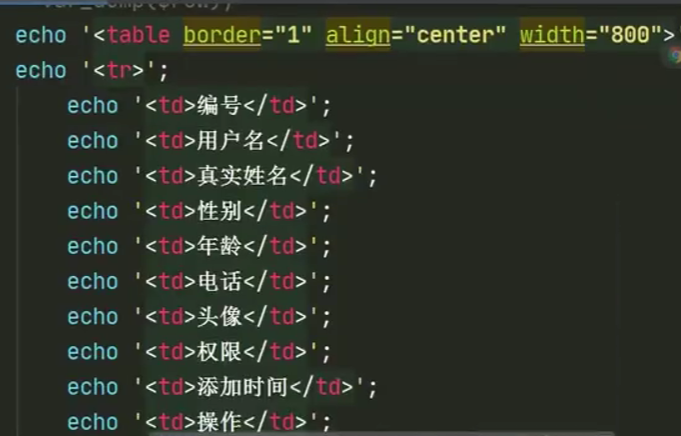
>
> - html中写sql语句需要<php? 变量名?>
>
> - php**排错时要从sql语句开始排错**。
>
>   ```php
>   $sql="";
>   echo $sql;exit;
>   ```
>
>   **然后把显示的sql语句赋值粘贴进mysql执行，看成不成功。**
>
> - `die(message)`在退出脚本前显示message信息
>
> - php中，用`.`来实现字符串和变量的链接
>
>   ```php
>   "它的密码是".$key."值"
>   ```
>
> - PHP中**反引号**的作用
>
>   - 执行系统命令
>
>     echo `ipconfig`；
>
>   - 内涵SQL语句的关键字时
>
>     $sql = "select `user`,username from `Content`";
>
> - **匿名函数**（闭包函数）
>
>   实现php闭包既可以读取函数内部的变量，同时还可以将变量始终保存在内存中，使得即使函数执行完毕，变量也将一直存在。
>
>   **子函数可以使用父函数中的局部变量**
>
> - PHP中`array（）`
>
>   只写array()说明新建了一个新的数组，php里有索引数组、关联数组、多维数组。
>

### 使用PHP进行数据库插入操作

PHP中写sql语句，要把sql语句用双引号括起来并写入一个变量里

> - `mysqli_connect('数据库所在地址'，’用户名‘，’密码‘，’数据库名‘)`-->数据链接函数
>
> - `$link=函数1 or die（）`来判断函数1的执行是否有错，有错则会爆出所有信息。加`@`不爆出。-->出错怎么办
>
> - `mysqli_query（链接的数据库赋给的变量，sql语句的变量）`，发送一条SQL语句到数据库服务器。
>
>   insert插入返回布尔值，执行成功为true，失败为false-->发送sql语句函数
>
> - `mysqli_affected_rows(链接的数据库赋给的变量)`-->获取数据影响行函数
>
> - `mysqli_insert_id(链接的数据库赋给的变量)`，返回的是添加的哪一行的id
>
> - ` mysqli_close(链接的数据库赋给的变量)`-->关闭数据库

 

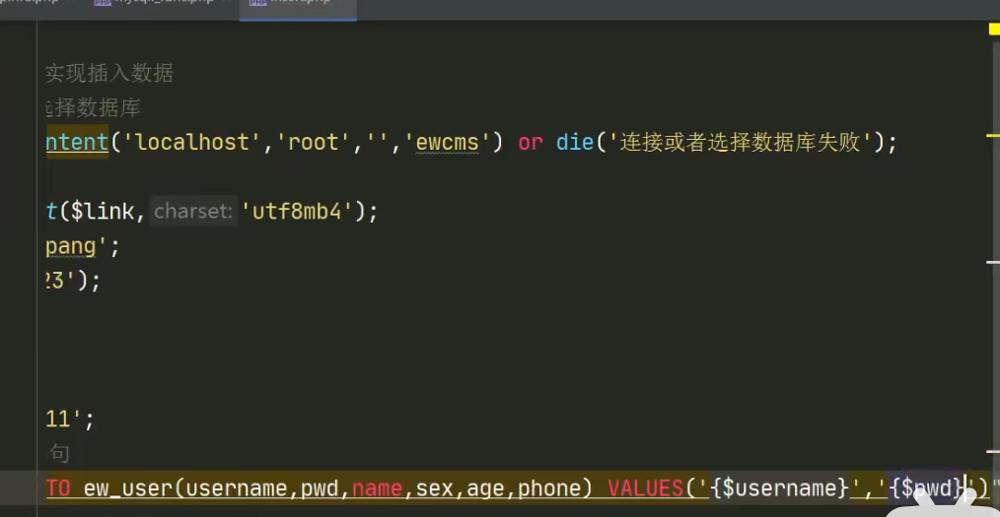

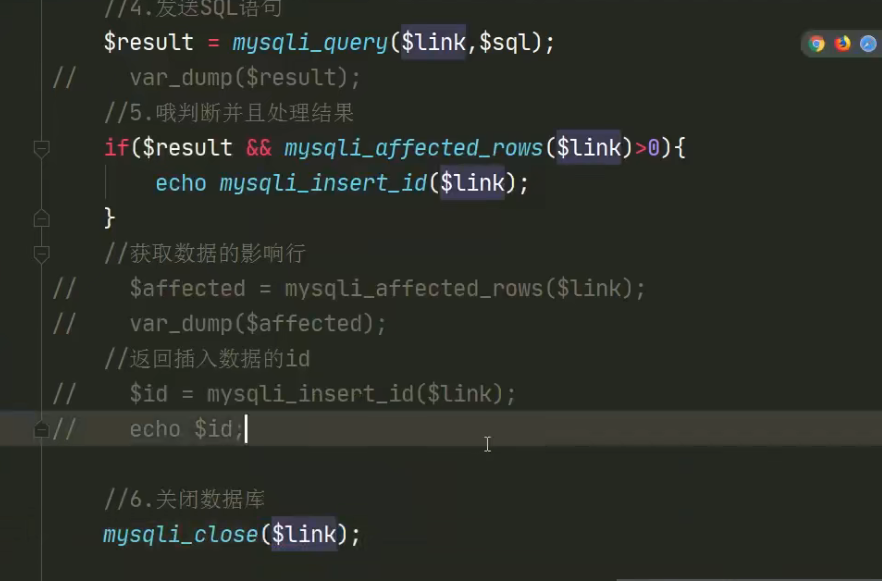

### 使用PHP进行数据库查询操作

> - `mysqli_num_rows(问答函数出来的对象)`，返回值是对象的行数
>
> - `mysqli_query(链接的数据库的变量)`，对于查询而言返回的是一个对象
>
>   
>
> -  `mysqli_fetch_assoc(问答函数出来的对象)`
>
>   获取一行作为关联数组返回。
>
>   如果数据库里什么都没有，就会返回NULL

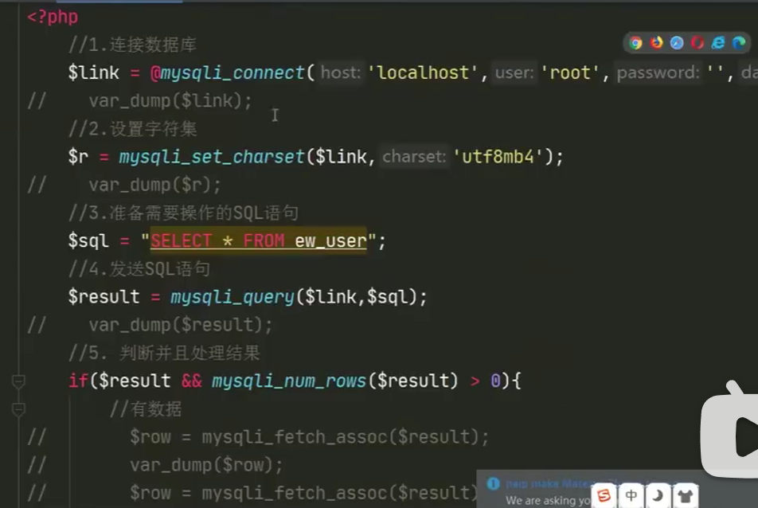

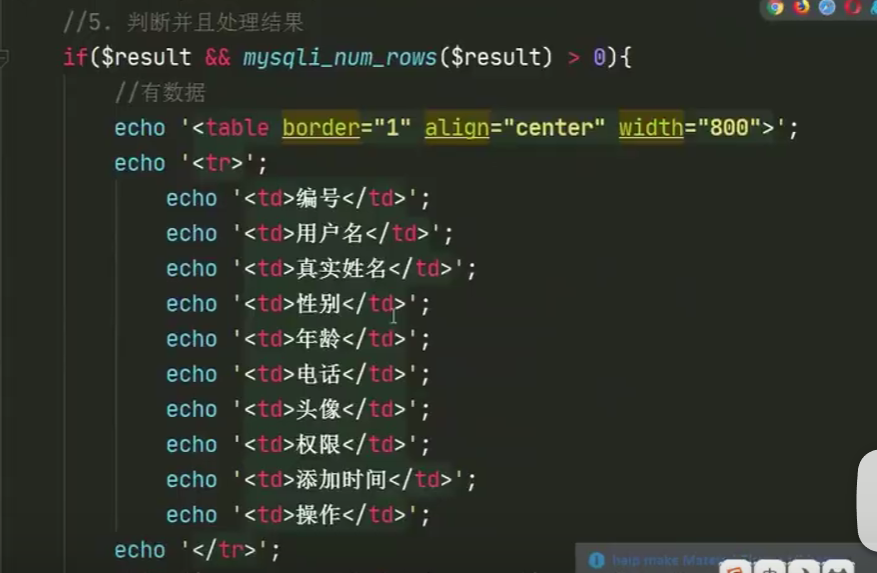


### 使用PHP进行数据库修改

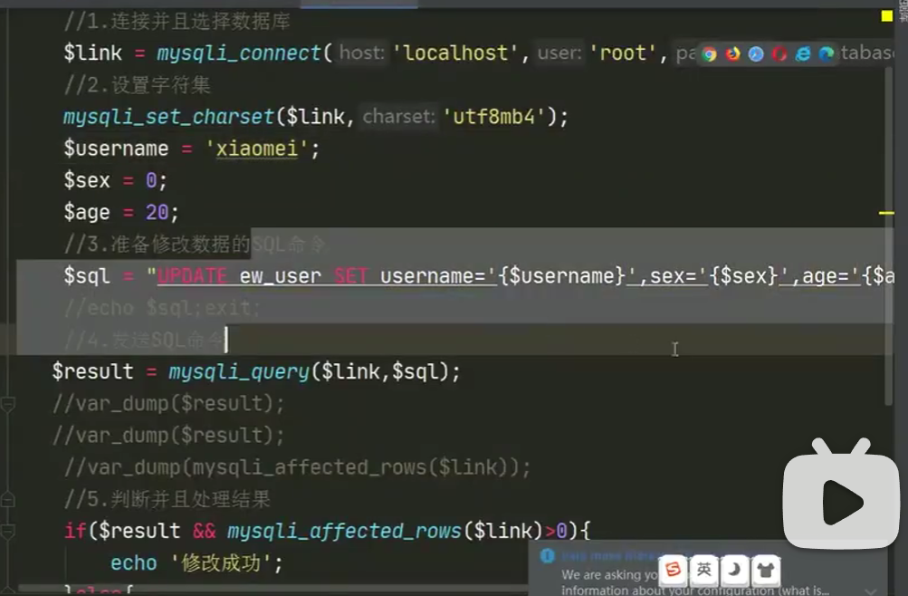

### 使用PHP进行数据库删除

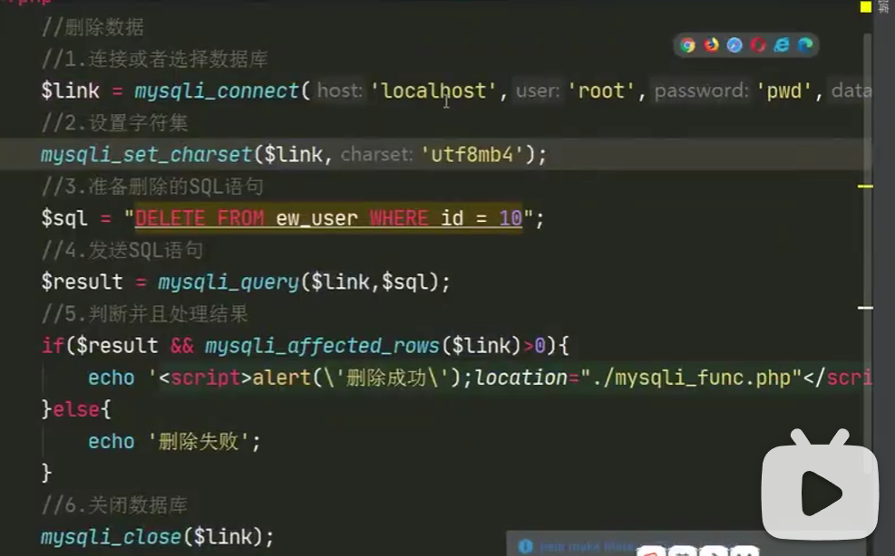

把删除函数可以写到查询的那个文件（**func.php**）的表格里：
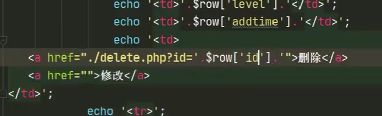

**delete.php**中写入sql语句的传参也要改一下：

**这里能用$_GET变量是因为我们发现，这个网页是以get方式传参的。**

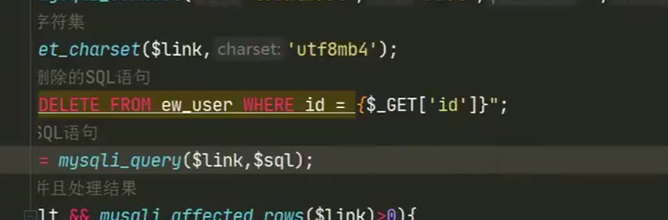

### 函数的封装（Model模块）

**关联数据库**的函数

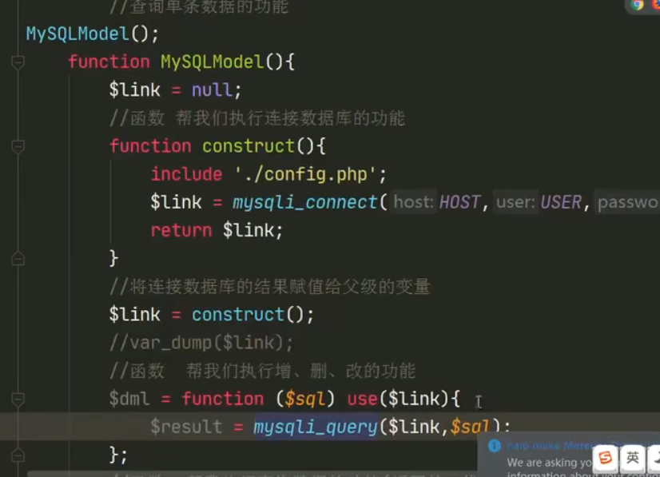

**增删改功能的函数：**

这里有一个正则表达式，此函数是一个**闭包函数**，用来在这个函数里使用父函数的变量，注意格式`变量=function(用户给的变量，这里是sql语句) use(传进来的父函数的变量)`

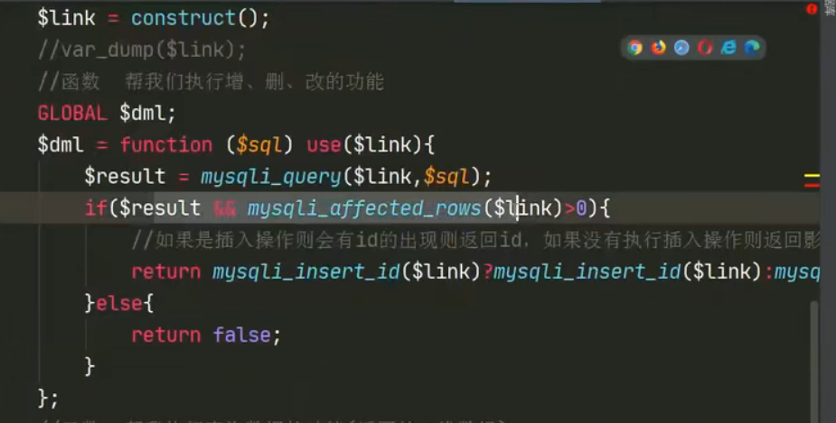

**查找**的函数：
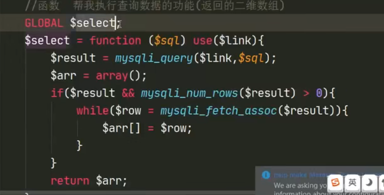

**统计行数**的函数：
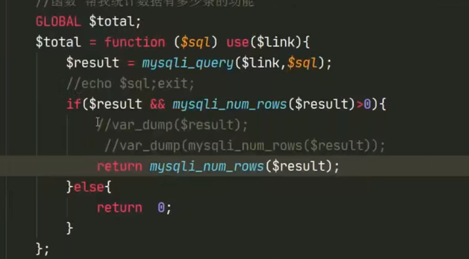

**查询单条**数据功能：

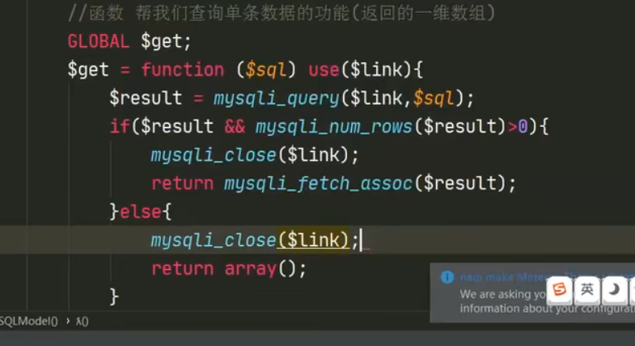

**关闭数据库**的添加语句：

注意代码逻辑。

<a name="代码逻辑2"></a>

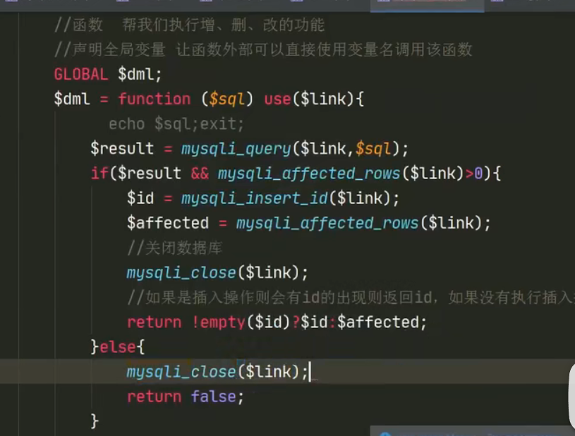

### 预处理

- 目的：**防止SQL注入**，且执行效率快

  > 就是把自己的sql语句**拼接**进后台所写的SQL语句里

  而预处理就不是字符串拼接的方式

- 基本原理：SQL语句不是一条一条的发送，而是直接存储在SQL数据库中（最后程序结束还是要释放），等待那个值的传入。

  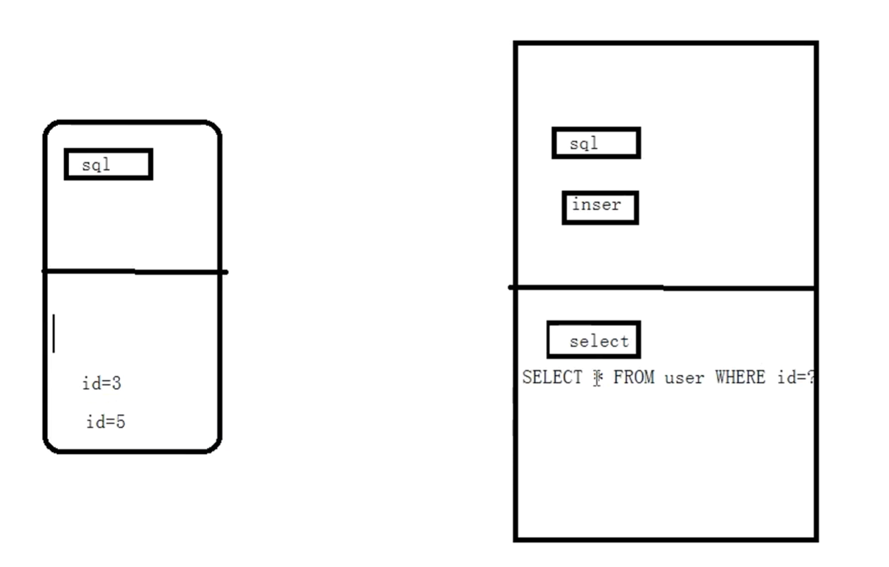

- 具体实现

  type中`i`代表int，`s`代表string。

  需要**准备预处理**和**释放预处理**。

  用`?`占位。

  

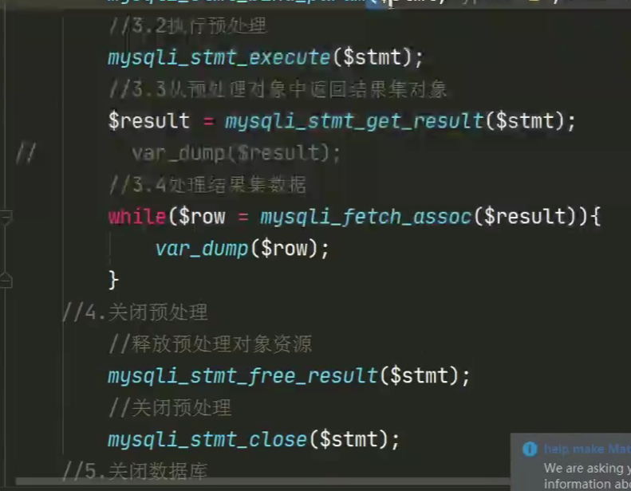

推广：（若查询的东西变多以后）

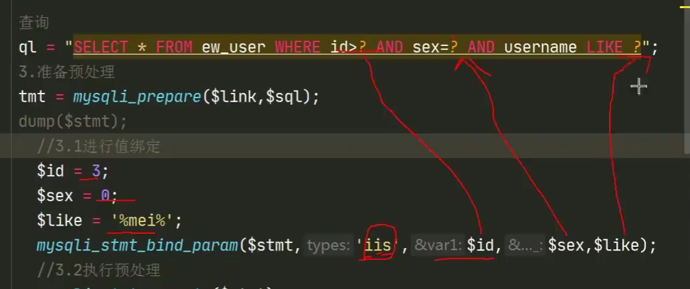

# 总结：

重点掌握：

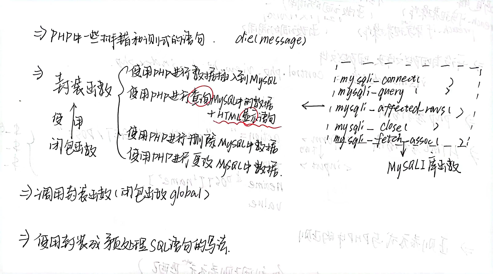