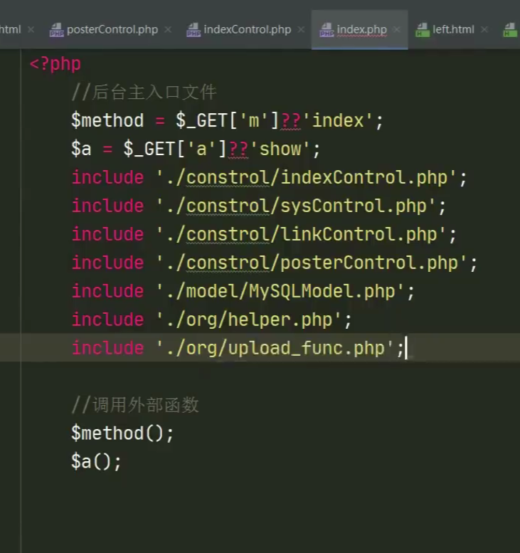
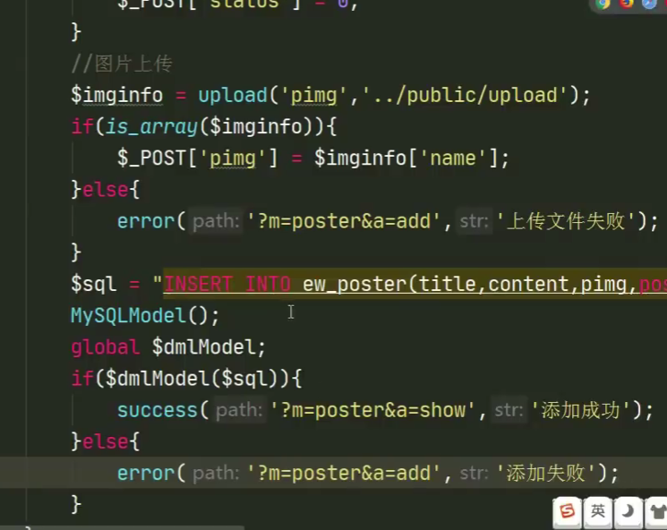
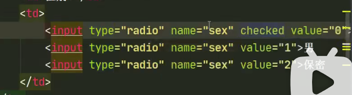
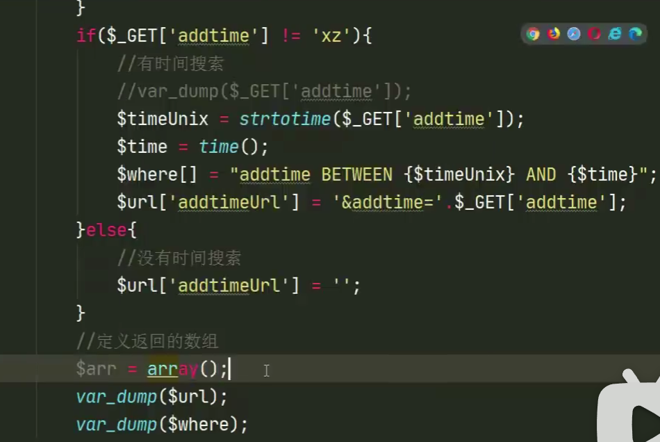
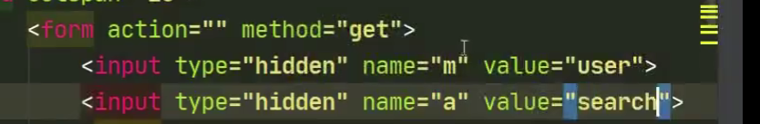
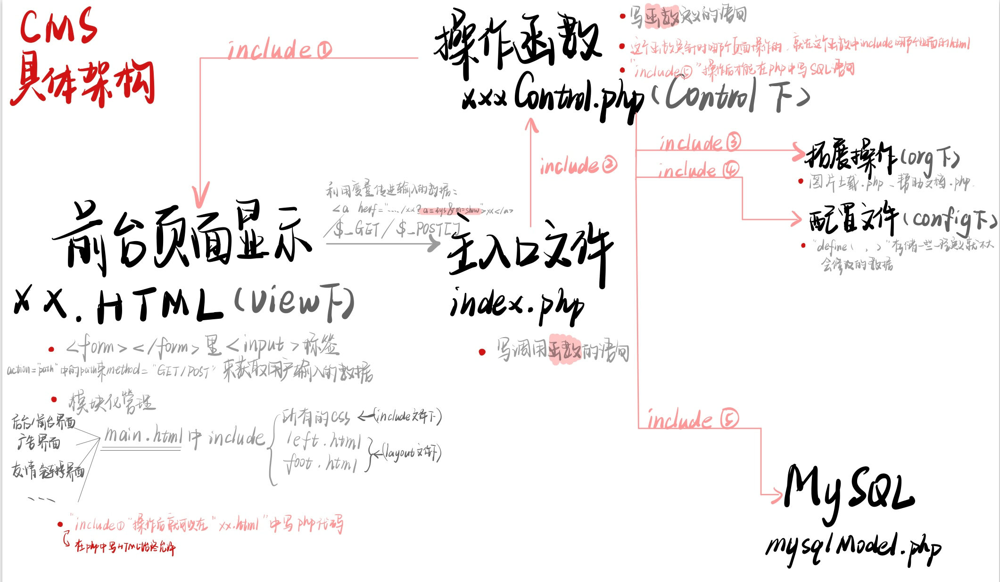

[代码逻辑3](#代码逻辑3)	[代码逻辑4](#代码逻辑4)	[代码逻辑5](#代码逻辑5)

# cms架构B（PHP+html+mysql的model）

### PHP基本语法E

> - 两种在HTNL中写php的写法：
>
>   ```php+HTML
>   <?=变量名?>
>   <?php
>       pass;
>   ?>
>   ```
>
> - `empty(x)`函数。x为空或x**为0**，结果都返回true（注意这里有个坑）
>
> - `emplode(用什么分割，数组)`函数，用来分割数组中的每一个元素。
>
> - `count()`返回数组中元素的个数。
>
> - 用新的数组前，需要定义它
>
>   ```php
>  $shuzuming=array()
>   ```
>
> - `isset(x)`函数，如果x的变量存在，返回true。否则返回false。
>
>   一般判断语句为 如果变量x设置了且不为空。
>
> - `is_mumeric()`检测一个变量是否为数字或者数字字符串。
>
>   有的时候用empty()函数不理想会考虑能否用此函数。
>
> - `strtotime() `函数将任何英文文本的日期或时间描述解析为 Unix 时间戳
>
> - `time()`获取当前时间戳函数
>
> - `md5()`  把从前台用户输入获得的密码在php中（control.php中）进行md5的加密，再存进数据库中
>
> - `count()`计算数组中单元数目，或者对象中属性个数
>
> - `header()`函数
>
>   向客户端发送一个http报头，用来告知客户端信息，也可用于跳转：
>
>   
>
> - 自己定义的函数
>
>   `success(path'?m='，[str])`若成功则跳转的路径
>
>   `error((path''，[str])`若失败则跳转的路径
>
> - `ceil(x)`向上取一个最近的整数（大于x的）
>
> - 如果要在同级函数中调用另一个同级函数的变量，可以把那个要调用的函数声明为全局函数，或者使用闭合函数的写法。
>
> - **HTML**语法：
>
>   > - `form`里的`input`标签的属性有：
>  >
>   >   
>   >
>   >   - `hidden`属性：一般用来传值而不被用户看到。
>   >
>   > - `select`标签
>   >
>   >   单选或多选菜单，里面有`option`标签,其中
>   >
>   >   - `value`属性，这个option如果被选了，那么如果整个select封装成表单提交的话，传出的`$_POST`或者`$_GET`**数组的值就是这个value**
>   >   - `checked`加了一个checked属性，可把此复选框/下拉栏设为选中状态。[详情](#checked)
>   >
>   > - `span`行级别，不自动换行。把标签中间的文字给一个特定的样式
>   >
>   >   等同于HTML5的`font`标签。
>   >
>   > - `div`块级别，自动换行。把这一块的东西给一个特定的样式
>   >
>   > - `script`标签里有`alert`弹框弹出，`location`属性表示跳转的位置。
>   >
>   > - `li`标签（表示单元格）可以在有序列表`ol`里，也可以在无序列表`ul`里
>   >
>   >   
>   >
>   > - `form`标签（`action`属性表示提交到哪个页面、`method`方法表示是**post提交还是get提交**）
>   >
>   >   表单标签，内涵`input`标签，提交表单的意思
>   >
>   > - `font`标签，指定大小、文本颜色
>   >
>   > - `td`标签，表示表格的一行，其中，
>   >
>   >   - `class`属性，定义标签的名字
>   >   - `colspan`属性，指明列宽
>   >   - `style`属性，指明是左对齐还是右对齐
>   >
>   > - **css样式和html相连**
>   >
>   >   
>   >
>   >   
>
> - 当用post方法传参进php文件里，此**php文件里写入的是sql语句**（已经有sql模块时）
>
>   
>
> - **php中变量和字符串怎么链接**
>
>   
>
> - **一个函数里声明的全局变量不可直接在另一个函数里写这个变量。**
>
>   如果非要写，则在另一个函数里这个变量要加上全局变量。
>
> - **闭合函数的调用**（下面有写）
>
> - `is_array(变量)`，这个变量是不是数组，返回布尔值
>
> - 在php里进行读取数据库的数据并把数据包到html的表格形式里：**在php中写HTML语法始终被允许**
>  
>
> - php里的`switch语句`
>
>   

### 以友情链接为例的流程

**注意control与前台HOME初次关联的流程**。（其实跟前面所学的control与后台admin关联的流程一样）

注意**闭合函数的调用**格式。注意**封装的跳转路径**(success、error)怎么写。注意**所需的所有文件名**。

- 每次添加或删除或修改完数据都需要一个跳转-->想到**封装**：

  **org文件**下（**helper.php**文件里写）

  

- 当我们的**contrl.php**与后台数据库关联时

  linkControl.php里调用mysql模块（php链接mysql）。

  **注意这里的`$selectModel`是一个函数下声明的全局变量，要在这个函数里调用，需要再声明一个`global`。**

  且这里的`$selectModel`是一个闭合函数的函数名。

  这里调用的sql语句的函数**返回的东西存储在`$_arr`数组中，在包含的html中只要写关于数组`$_arr`的遍历就可以了**

  

  **linkControl.php**里所有的定义的函数：

  

- home下，**index.php**即 前端主入口文件

  

- Control模块下，**indexControl.php文件**：

  用于显示首页的html，至于为什么要在php文件里调用显示html，当然是因为要显示的变量是经过php操作的。

  

- Admin下，**index.php，后台主入口文件**

  

### 以广告模块为例的流程

注意**图片的上载**，和在前台**以幻灯片播放的形式显示**。**注意小圆点的个数动态改变的函数。**

- 图片**上载的数据存进mysql**。contrl.php文件下

  

- 在前台的main.html中**循环广告图片**

  

- **前台幻灯片圆点个数**根据图片的数量显示

  如果需要不管上传了多少张图片，都只取前四张。则在写sql语句的时候加order by 和limit 4 限制就可以了。

  

  

### 以后台会员模块为例的流程

**注意下拉框。注意添加会员板块的具体书写。注意显示会员列表的具体书写，其中的遍历很重要，注意分页操作的代码逻辑和php书写，注意搜索的html书写**。注意**代码块**中是自己跟着写一遍对整个流程和代码逻辑和架构和语法更加清晰。html向control.php**传值的两种方法**。注意搜索**操作的逻辑**，注意**数组中元素的拼接**，注意前台**html页面怎么通过url传参跳转改变**。**修改操作的大概逻辑。**

- **写url拼接数组和sql语句拼接数组很重要**。[详解](#重要)

- 在add.html中，即添加会员的网站前台页面中，加入**下拉框选项的添加**

  

- **添加会员功能**

  注意看考虑的**多种情况**，先进行多种情况的判断，再执行SQL语句插入进mysql数据库中

  此处`thump（）`是自己写在org文件下的图片压缩函数。如果传图片一定能拿到一个`$_FILE`变量存储的是图片信息。而`$_POST`里一定不会接收**图片信息**，所以**最后要赋值进`$_POST`的数组**里。

  

  

- **显示会员列表**

  - 注意**代码逻辑**<a name="代码逻辑3"></a>

    

    外层的$level存储的是级别，而内层的$v存储的是用户给的数字，正**好可看成下标**。

    ```php
    $level=["高级","中级","低级"];--在control.php里面的show函数里面写
    $v['level']=[0,1,2]; --用户在input标签里通过select里的option属性传值时，value标签给的是“0,1,2”
    ```

    **value属性给的是数字值**的示例：

    

  - 下图为**show函数**（在contrl.php中调用的）中include的前台html，（**在显示会员的前台html中,遍历[`$_arr数组`](#$_arr数组)**）

    

    下图为**show函数的写法**（写＋调用了sql的model的封装函数）

    
  
- **将显示的内容分页（代码）+调用搜索函数（代码）**

  写在show.html里：注意tr、td里面套a标签。

  

  注意此**分页操作的代码逻辑**，在control.php的show函数里面写。

  <a name="代码逻辑4"></a>

  ```php
  <?php
      function user(){
      	function show(){
  			MySQLModel();//调用的用php写sql语句操作的封装的模块
              global $selectModel;
              $search=search();
              //然后进行数组的拼接（见下）
              var_dump($search); //调用下面的搜索操作
              //1.确定分页的显示数
              $page=5;
              //2.获取MySQL里的数据的总条数
  			$sql="select * from ew_users";
              global $totalModel;//也是另一个闭合函数名
              $total = $totalModel($sql);
              //3.得到总页数
              $pageAll=ceil($total)/$page
              //4.获得当前页
              $dpage=$_GET['page']??1;
              //5.处理上一页
              $prePage=$dpage-1<1?1:($dpage-1);
              //6.处理下一页
            $nextPage=$dpage+1>$pageAll?$pageAll:($dpage-1);
              //7.设置limit跳步的数值
              $num=($dpage-1)*$page;
              $limit="LIMIT {$num},{$page}";
              $sql="SELECT * FROM ew_user".$limit;//这个函数实现的功能。输如要查询的sql语句
              $sex=array('女','男','保密');//为下面include的show.html中写的php代码的数组遍历铺垫
              $level=array('<font size="5" color="green">超级管理员</font>','普通管理员')//这里把管理员加了一个显眼的字体样式
              global $selectModel;//闭合函数名$selectModel，此函数存储的是有关SELECT的对于数据库的全部操作。原本在MySQLModel()内是全局函数，所以在其他外面调用时，也要声明一个global
              $arr=$selectModel($sql);
              include './view/user/show.html';
          }
  }
  ```
  
- **搜索操作的函数**

  <a name="重要"></a>

  - **代码逻辑-数组元素的拼接**

    <a name=代码逻辑5></a>

    以下代码表示把sql的所有条件性质的字符串进行拼接。

    

    以下为拼接“&xxxx”的url

    

  - 搜索操作是如何**让前台的html页面只显示搜索出来的东西**的

    通过**改变url**（传入html中的input中的value值）

    

  - **搜索操作的大概逻辑**

    通过**多个if语句实现**，每一个if语句查找有没有这个条件限制，**如果有就给一个这个条件限制的SQL语句一部分和url一部分**。最后在show中调用完了之后进行数组（字符串）的拼接。

    以年龄查找和时间戳查找为例：

    

    

  - 删除操作

    调用modul中的删除函数的sql模块

    删除成功后页面的跳转为show（）这样才能显示删除后的前台页面。

    

  - **修改操作**

    点修改的**超链接应该跳转**到的是仅有要修改的那个id的一个专门属于修改操作的页面：

    

    在edit（）函数里写**拿出那一条要修改的数据**的操作和**修改本身的操作**和**include进修改操作的专门页面edict.html**。

    

    在edict.html首先**显示未修改前的这条数据的内容**（通过在edict.html写value属性的值为$data[]），然后进行在control.php中写各个数据的修改。**复选框或下拉栏用checked，图片输入和文本（密码）的输入用另外写的函数**，并**写入sql语句**。

    

    sql**语句的发送**（用预先写好的sql封装函数）：**不用担心修改后的页面怎么显示，mysql中修改了之后，再调用show函数就能显示更新后的结果。**

    

    - **`checked`属性**实现下拉栏、复选框的修改：

      <a name=checked></a>

      仅设置checked属性不赋值，可以将复选框/下拉栏设置为选中状态。

      将checked属性值设置为"checked"或者“true”也可以将复选框/下拉栏设置为选中状态。

      例如：html中

      

      control.php中：

      
- **两种把HTML中页面获取到的值给php文件的方法，**

  - 第一个**show函数**的调用已经通过action传参，传入的是给`user（）`和`show（）`函数。

  - 第二个search函数的调用如果继续用此方法，那么只会传入`user（）`和`search（）`，不会保留原来`show（）`函数的传入值，但我们想在同一页面下，既显示`show `的内容，又显示`search`的内容，所以不用`form`的`action`属性进行传值，而**用`input`标签的`hidden`属性进行传值**。
  - 本质是让`$_GET数组`**的值不是serch的参数覆盖show 的参数，而是serch的参数跟在show参数的后面。**

  

### html与sql与php相连的语句总结

1. **SQL+PHP**（在php里写sql语句，此语句后面要经过sql模块）

   功能是把Mysql数据库中的数据拿出来进行操作，**在封装操作的sql语句时用**

   ```sql
   "sql语句".$_GET['id'] --利用字符串的拼接，$_GET里为用户输入
   --字符串与变量链接：
   'sdsds'.$_变量名.'dsd'
   ```

2. **SQL+PHP**（在php中写sql语句，在sql语句即双引号的内部）

   功能是把用户写的东西(用户在前台输入的东西)以php变量的方式传入（预定义变量）sql语句，从而存入Mysql。**调用封装的sql语句时用。**

   ```sql
   $_sql="...SET webname='{$_POST['webname']}'"
   ```

3. **PHP+HTML**（在html的标签里写php变量）

   **用于把php处理过的变量显示出来**（可能存储的是mysql查出来的数据，也可能存储本来前台用户输入的但经过php操作的变量）

   ```html
   <input type="text" name="ord" value="<?=$data['ord']?>">
   ```


# 总结

- HTML与PHP

  > HTML:超文本标记语言
  >
  > PHP：服务器脚本语言
  
- CMS抽象架构（PHP环境）

  

- CMS具体架构



- 细节补充（针对上面具体架构写不下的地方进行细节补充）、

  - MySQL与前台页面显示关联的具体数据传送细节（modul中封装函数的具体用法）

    <a name="$_arr数组"></a>
    
    
    
  - 关于url和前台html的显示
  
    
  
  - **执行删除或修改（用checked改"选项"的type，用单独函数改文本或"图片"的type）操作后，只要已经对数据库Mysql进行了修改，就不用担心前台显示的数据能不能更新了，再次调用show（）函数一下就更新了。**
  
    执行添加add或者显示show操作，怎么把后台的数据返回给前台的：add是通过给post数组赋值，让post数组变得完整（主要是原来的post数组没有图片名），然后传入sql的封装函数中，这个封装函数查询出来的结果会返回一个数组arr[]，再把这个数组arr[]在html中遍历。