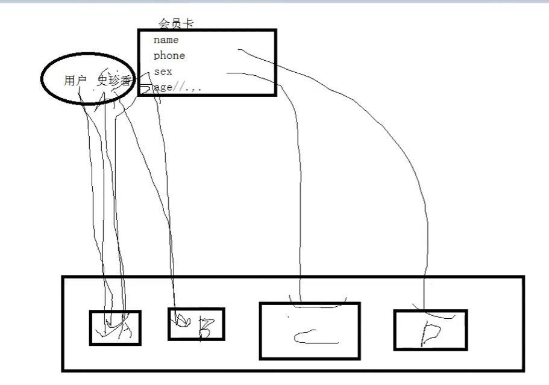
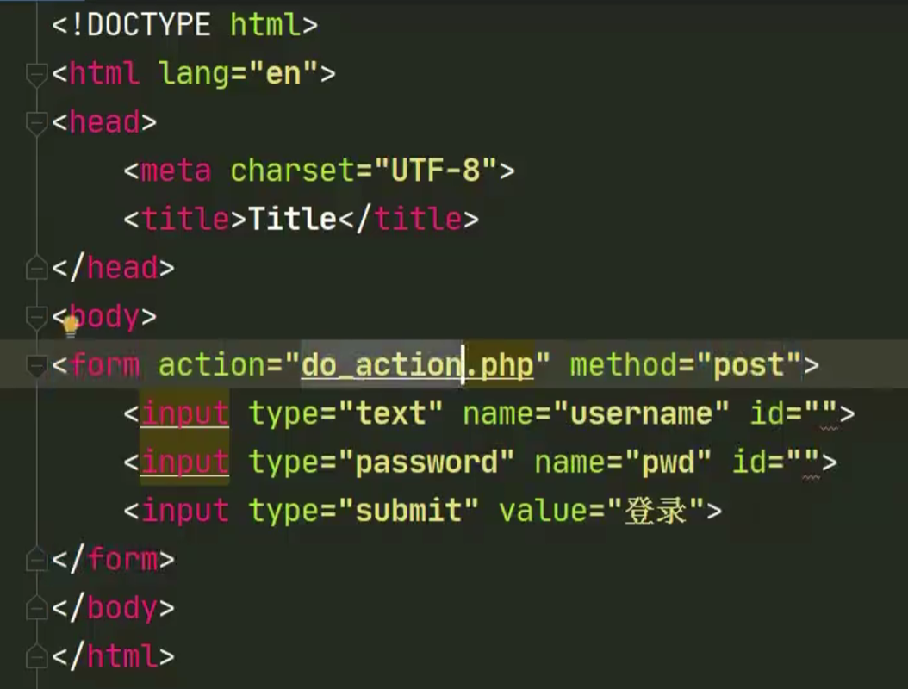
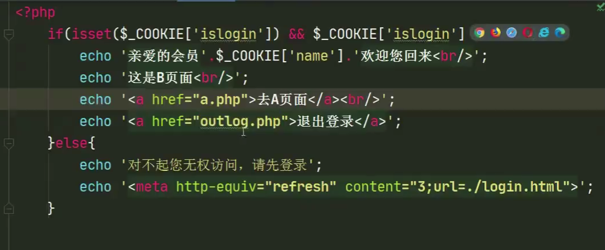
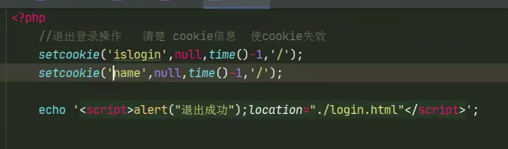
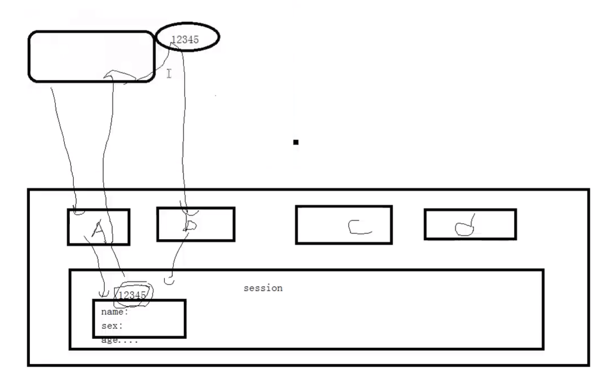
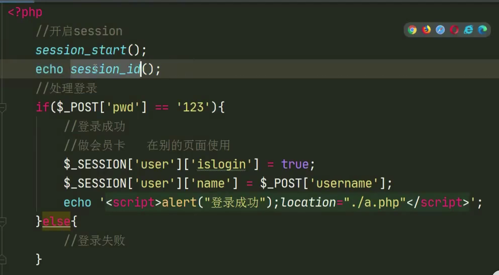
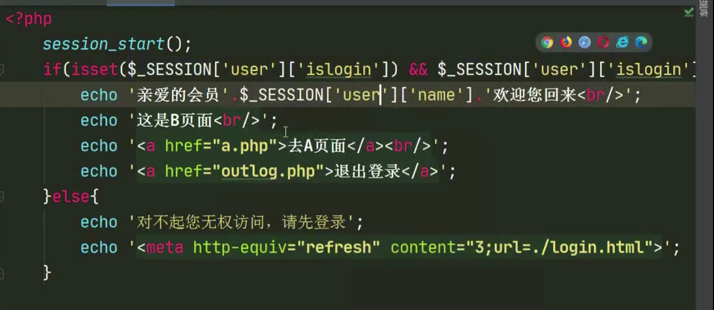
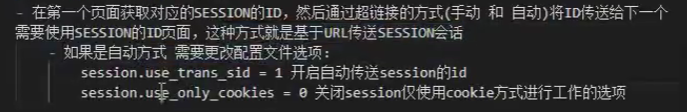

# PHP基础

### php基本语法F

> 基本HTML之meta标签
>
> > - 组成：
> >
> >   - http-equiv属性
> >
> >     目的：相当于http文件头的作用。
> >
> >     参数有：
> >
> >     Expires（期限）、Pragma（让访问者无法脱机访问）、Refresh（刷新）、Set-Cookie（cookie设定，例如如果网页过期，cookie将删除）、Window-target（窗口显示设定）、content-Type（显示字符集设定）
> >
> >     - content属性（即http-equiv属性的值）
> >
> >   - name属性
> >
> >     目的：告诉搜索引擎关于这个网站的信息的名字
> >
> >     参数有：Keywords（关键字）、description（对网站内容的描述）、robots（机器人向导，用来告诉机器人哪些需要索引哪些不需要）、author（作者）、generator（信息参数，网站用什么软件制作的）、COPYRIGHT（版权信息）、revist-afte（网站重访）
> >
> >     - content属性（即name属性的值）
> >
> >       目的：便于搜索引擎机器人查找信息和分类信息用
> >
> >       参数有：
> >
> >       - robots中：
> >
> >         all（文件将被检索，页面中的链接可被查询）、none（文件不被检索，页面中的链接不可被查询）、index（文件将被检索）、follow、noindex、nofloow。
> >     
> >   - 作用：
> >
> >     **SEO（搜索引擎优化）**、定义页面使用的编码、自动刷新并指向新的页面、实现网页转换的动态效果、控制页面缓冲、网页定级评价、控制网页显示的窗口
> >
> >   
> >

# HTTP协议

- 一种超文本传输协议
- 无状态跟踪协议（老年痴呆型）
  - 当你访问了服务器后，关闭网页，再次访问服务器，服务器不会意识到是你在访问（记不住人）
    - 方法一：**基本思路**。如果客户端浏览器的应用程序需要和不支持cookie的服务器打交道，那么只能使用最原始的，用input标签读取用户输入到的信息，并传入php中，再与数据库中的用户名和密码做对比。（用户名和密码一般都会存储一份在服务器中）
    - 方法二：**实现不需要每次都输入用户名和密码**。把用户名和密码存储到浏览器里，然后**让每次HTTP请求都自动带数据给服务器**。这个技术我们称为**cookie。（存储用户信息的凭证）**
    - 方法三：比cookie更安全的方法，**会话Session**，即把**Session-ID加入到cookie中**，而**Session-ID**对用户名和密码做了加密，并**存储在服务器**中。  

# Cookie

### 是什么

- cookie的**工作原理**：（即带着一张储存访问信息的卡片，只要set-cookie后，每一次请求都要带着）

  

- cookie都是**存储在客户端的**。

  - 即客户端可以查看cookie

  - 客户端也可以禁止cookie
    - 禁止后，如果有些网站是需要拿cookie登录的（即cookie中存储用户名和密码），则登录不进去了
  - 通过PHP可以创建并取回cookie

- 功能

  - **cookie解决的是http超文本链接协议属于无状态协议的问题**
    - 无状态协议：当你访问了服务器后，关闭网页，再次访问服务器，服务器不会意识到是你在访问
  - **cookie可以存储用户名、密码、登录有效时长**

- 弊端

  - 不安全。因为直接存储在客户端，所以依赖于客户端，所以如果你的客户端浏览器被黑了，那么所有存在cookie中的密码用户名将会泄露。改进：**会话Session**

### 使用方法

- 核心：`setcookie()`函数

  - 添加cookie值

    ``````
    setcookie('下标','值','有效时间','有效作用域')
    ``````

    第四个值如果是`/`表示当前作用域下可以用

  - 修改cookie值

    ``````
    setcookie('下标','新值','有效时间','有效作用域')
    ``````

  - 删除cookie值

    ``````
    setcookie('下标',null,'有效时间','有效作用域')
    ``````

  - 查看cookie值

    - 依赖系统所提供的`$_COOKIE`预定义数组变量，所有的对cookie设置的值都会成为该数组变量的一个元素。例如使用特定的COOKIE的值`$_COOKEI['下标']`
    - 查看用`var_dump()`和`print_r()`，但无法在添加/删除/修改的当前页面查看COOKIE值。

  - `$_COOKIE()`数组

    - 一个**预定义数组变量**
    - 一个可**以跨页面的变量**

### 代码流程

1. 在html页面中，写从用户获取用户名和密码的语句，利用`form表单`和`post传值`进一个php文件进行处理。

   

2. **创建cookie**，在那个**php文件里写处理传进来的值的操作**，操作用`setcookie()`数组

   

3. **登录（验证特定的cookie信息是否存在）**后的界面书写，**一个php**里：

   

4. **退出登录（清除cookie信息）**操作，一个php里

   

# Session

### 是什么

- 工作原理

  

- **`Session_ID`会存在cookie里**

  - **Session_ID是一个经过服务器对原始的用户名和密码，加密后的一串数字，所以只有服务器存储了原始用户名和密码**
  - Session_ID服务器会存一份，客户端会存一份包含了Session_ID的cookie
  - 每一次会话的请求，客户端都会带着含有Session_ID的cookie向服务器发送请求

  - 所以如果在客户端浏览器中关闭cookie服务将登录不了
  - 如果黑客修改了Session_ID，服务器就将识别不了

### 使用方法

- `session_start()`开启session会话

  只要使用的Session的相关函数或者数组，就必须要在最前面加一个这个函数。

- `sessionid()`设置或获取Session_ID的值

- `session_name()`获取cookie中的session的名字的函数，便于适应名字的改动。

- `session_destroy()`摧毁服务器中的session文件

- 核心：`$_SESSION()`预定义变量

  - 添加session

    ``````
    $_SESSION['下标']=值
    ``````

  - 修改session

    ``````
    $_SESSION['下标']=新值
    ``````

  - 删除session

    - 删除session的变量值（保留数据类型）

      ``````
      $_SESSION=array()
      ``````

    - 删除所有的session信息（包括服务器中的session_ID的文件）

      **一般用于退出操作**

      1. 使客户端COOKIE中的session过期
      2. 清空`$_SESSION`的变量值
      3. 摧毁服务器的SESSION文件

  - 查看session

    - 查看全部session信息

      `var_dump()`或者`print_r`

    - 查看特定session信息

      `$_SESSION['下标']`

### 代码流程

1. 在html中写用户输入的东西。

2. 在那个php文件里写处理传进来的值的操作。

   

3. 登录后的界面书写，一个php里

   

4. 退出操作（比cookie多了两步操作）

   


### session配置文件

- 如何**找到关于session的配置**

  `php.ini`文件-`[SESSION]`模块里

- **配置文件相关选项**

  > `session.save_handler = files` 设定session的存储方式为files文件形式
  >
  > `session.use_cookie =1`    	是否使用cookie来存储session的id
  >
  > `session.use_only_cookie=1`		是否仅使用cookie来存储session的id；若设置为0就是可以用**（除了cookie以外的）其他传送方式（自动/手动）传送session_id**
  >
  > `session.name=PHPSESSID`		设置session的名字为PHPSESSID
  >
  > `session.auto_start=0`		设置用户是否自动开启session
  >
  > > 类的加载必须在开启session之前，所以不能设置自动开启session
  >
  > `session.cookie_lifetime=0`		session使用cookie的生存时间，0表示关闭浏览器前都有效
  >
  > `session.cookie_path= /`			设置session使用cookie的有效路劲，`/`代表当前路径下有效
  >
  > `session.cookie_domain = `			设置session使用cookie 的有效域名，`空`代表当前域名下有效
  >
  > `session.cookie_httponly = `		设置session使用cookie这一操作是否只被允许在http协议中
  >
  > `session.serialize_handler = php`		`session`的串行化方式为php的串行化方式
  >
  > > 串行化：把多个属性值转化成一个字符串的方式
  >
  > `session.gc_probability=1` 		垃圾回收机制的除数
  >
  > `session.gc_divisor=1000`		垃圾回收机制的被除数
  >
  > `session.gc_maxlifetime = 1400`		session垃圾回收的最大时间
  >
  > `session.user_trans_sid=0`		session是否使用自动传输方式传session的id，**0为不自动（即手动），1为自动**
  >
  > `session.trans_sid_tags="a=href,area=href,frame=src,form="`		session可以传送id的方式
  
- **session_id的传送方式**

  - 方法一：一般通过cookie传送

  - 方法二：基于`URL`的session会话原理（不通过cookie）

    **此方法当禁用cookie时，也可以使用成功**

    
