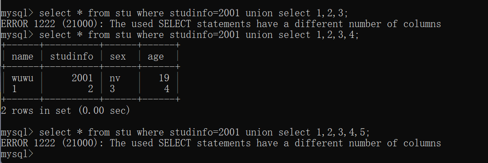

# 导读

本来没想实操的，但是由于在学SQL注入的时候遇见了很多问题，不理解那样的SQL语句的执行会产生什么结果。一开始花费了很多时间上网查，查到最后发现还是自己创建一个库写一遍比较方便。

# 安装MySQL

- 记住软件安装目录和数据保存目录


- 记下账户和密码，都是`root`
- 记下设置的MySQL名字：`MySQL57`
- 配置环境变量
  - 原因：本来只有在安装目录下启动MySQL.exe文件才能有效，但是配置了环境变量后，可以直接在cmd中执行`mysql`就可运行启动。
  - 环境变量也可看做是全局变量

# 几个重要安装目录

- DATA目录下

  - 存放错误日志文件

  - 存放三个目录（系统默认的数据库）

    `information_schema`

    `mysql`

    `performance_schema`

    `sys`

  - 自定义每创建一个数据库，都会在data目录下生成一个文件夹

    - `.FRM`后缀，存放表的结构信息
    - `.MYD`后缀，存放数据信息

- 总览的几个目录

  - 数据库系统管理软件安装目录

    “database manage server”

  - 数据库存放目录

    “Data目录”

  - 数据库链接目录

    “connector/J”（java链接mysql需要的安装包）

  - 客户端工具目录

    “workhench”（mysql客户端管理工具）

# 忘记MySQL登录密码

## 设置无需密码登录

执行语句，`–skip-grant-tables `会让 MySQL 服务器跳过验证步骤，允许所有用户以匿名的方式，无需做密码验证就可以直接登录 MySQL 服务器，并且拥有所有的操作权限。

```shell
mysqld --console --skip-grant-tables --shared-memory
```

接着不关闭当前的cmd，重新打开一个powershell，直接输入命令`mysql`就可进入到mysql中

## 坑：Can‘t change dir to报错

根本原因值下面的配置与电脑上的实际配置不一致问题。（或者说缺少data文件问题）

My.ini文件夹中此处配置改为以下，同时为了路径一致我们在那个文件夹下新建了一个data文件


# 进入MySQL

- 坑：提示系统访问权限不够

  >  未使用管理员权限打开。

## 开启MySQL和关闭MySQL

```SHELL
net start MySQL57
net stop MySQL57
```

> MySQL57是通过电脑-服务-所查到的本机安装的MySQL的名字

## 链接MySQL

```shell
mysql -hlocalhost -uroot -proot
```

> -h为服务器名，这里指本地服务区
>
> -u为数据库的用户名，默认root
>
> -p为密码

# SQL注入在MySQL中的真实查询结果

## example

`student`库里的`stu`表格


## 数字/字符型注入的原理

- `OR`逻辑加深理解：

  ```SQL
   select * from stu where studinfo=2000 or 1=1;
   #样例表中没有studinfo=2000这一数据
  ```

  这里，要把`studinfo=2000 or 1=1`连一起看，所以查询出来的结果：

  

- `AND`逻辑加深理解

  

## UNION语句之确定列数

> 由于使用union有一个前提条件，即union前后的两个查询语句所返回的列数是一样的。所以我们要事先确定列数。SQL注入中一般常使用以下两类。当然，经过实践，发现也有其他方法。

### 类`1' union select null,null,null--`

- 列数匹配和列数不匹配的情况,返回结果是不同的：

  

- 测试敏感类型

  - 结论1：null和‘null’等价，即类型不敏感

    

### 类`1' UNION SELECT 1,2,3,4#`

- 类似`1' union select null,null,null--`，都是除了查询前面的那个1之外，再返回一个一维数组，填了几列，这个数组就有几个元素。

  

- 列数匹配和列数不匹配的情况是不同的。

  

- 测试数据类型是否敏感，结果与null一样，即1与’1‘等价

  

### 其他也行

> 这里指的是，union中，上面的null和1，2，3，4都是**为了确定当前所在的数据库有几列**。
>
> 确定数据表有几列的这些东西可以看做占位符。
>
> 当然如果换成其他类型占位也可以。
>
> **总结：整型、NULL、浮点型、字符型都可以。**

比如：


## UNION语句之查找有用数据列

==待解决==

在我看来不管怎么输入都是一样的能够正确返回，但不知道为什么在CTF题目中就可以用这些语句测定字符串类型所在的位置。

在这个例子中第一列和第三列是字符串，但是我这么写并没有报错：


## 布尔盲注中`’a‘等价select ’a‘ from users`理解

> 为什么要用这么长的语句代替简短的`’a‘`?
>
> > 因为，注入点中必须输入的是sql语句（只有输入sql语句才能让查询有意义，才能查到我们想知道的结果），而不是单纯的只有`and`或者`or`的布尔判断句。
>
> ```SQL
> #正确完整：
> TrackingID' AND (SELECT 'a' FROM users WHERE username='administrator' AND LENGTH(password)>1)='a
> #如果把等价的长句直接替换成’a‘
> #那么这里的length函数就不能用，因为不再sql语句里了，这里的password列名也不能引用了
> #归根结底是因为这里AND的逻辑是跟着（where后面）前一个单词和后一个单词连在一起的
> TrackingID' AND (’a‘ AND LENGTH(password)>1)='a
> ```
>
> 


## 报错盲注中`SELECT ''`的理解

其实跟前面的null和1,2,3,4是一样的，返回的是一个一维数组。


## ~~报错盲注中`||`的理解~~

==以下不用看，都是尝试一下的随便写写，`||`在`MySQL`中没意义的==

> 首先明确`||`一般只用在`Oracle`数据库中，表示连接。
>
> 好像也是构造子查询的作用

随便写的一些在MySQL数据库中的例子：


这样写才可以用的例子：
