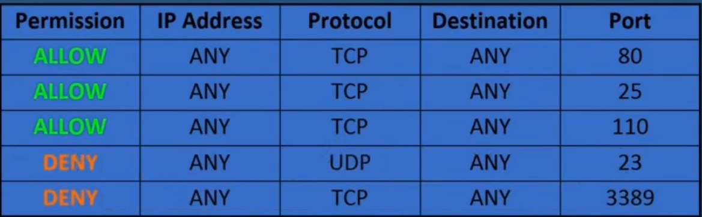

# Tomcat架构

## 问题提出

### 一台电脑只有一个IP，都用8080端口，为什么能挂两个网站？

请求消息中所包含的主机名被连接器给识别出来，并且放到了Request对象里面。

引擎通过Request对象里面的目标主机名，将Request对象派发给相应的主机来处理，因此一台电脑能部署多个网站。 

### 如何使浏览器访问主机名时访问本机的IP地址？ 

在C:\Windows\System32\drivers\etc下的hosts文件的末尾增添“IP地址 域名”的条目，就可以在本地进行该域名解析。

**即可以使对相同的ip地址和相同端口的访问，却可以实现访问不同的虚拟主机**

## 重点-server.xml文件

>  在config文件夹下


说明：

- 树形结构，XML语言
- 每个标签对应下图中的每个容器

## 核心架构


说明：

- 一个虚拟主机对应tomcat下的一个文件夹

- **上图中所有的方框都是容器**

- 连接器（Connector）负责通信，注册时需要指定监听端口和通信协议，通信协议的指定是为了传输信息的完整和准确性。

  连接器的功能：

  

- 引擎（Engine）负责处理请求。

## 总结

**通过这些容器，电脑上的Servlet被进行了详细的分类管理。**

连接器给出的request（请求对象）里面，包含了他要访问的servlet的详细路径，具体地说就是主机名、应用名（路径）和servlet名（路径），因此各级容器收到了对象之后，就能够把它正确的派发给下一级容器，最后达到目标servlet对象。

这个**request对象的层层转发过程，本质上是函数的层层调用过程**。

调用完成之后，连接器将得到一个response对象，连接器将response对象转换为字节流返回给浏览器，这就是Tomcat的核心架构和工作原理。 

## 参考文章

Tomcat的目录结构

https://www.bilibili.com/read/cv13861154

[JavaWeb开发必看！Tomcat架构及工作原理（8分钟）_哔哩哔哩_bilibili](https://www.bilibili.com/video/BV1J3411k7Xc/?vd_source=95bb0747454a6847ca940e34f9be508c)


# 监听端口

- **HTTP协议 ：默认80端口**

- **HTTPS协议：默认443端口**

- 端口：

  （作用回顾）：像“门”，**每个端口对应一个上层的应用程序，这个上层应用程序（进程）可以监听这个端口**

- 监听

  即这个应用程序监听这个端口来的数据

- 查看监听端口命令

  ```SHELL
  netstat -ano | find /i "listen"
  ```

- 特殊IP地址回顾：

  - 0.0.0.0    表示本机的所有地址
  - 127.0.0.1    表示本机的环回地址

- 实例（以python创建socket对象并绑定一个端口去监听一个IP地址）

  - python书写

    

  - 找“12345”这个端口，并用pid查找监听某个端口的进程是谁

    

  - 关闭端口直接结束进程就可以了

# Socket模块（python）

> “套接字”。针对某个服务端和客户端来进行打开、读写、关闭


## 参考文章

[python中的socket是什么意思？如何使用 - Jaoany - 博客园 (cnblogs.com)](https://www.cnblogs.com/fanglijiao/p/15060004.html#:~:text=python中的socket是什么意思？如何使用呢 Socket,一、概述 socket通常也称作"套接字"，用于描述IP地址和端口，是一个通信链的句柄，应用程序通常通过"套接字"向网络发出请求或者应答网络请求。)

# XML

> 独立于软件和硬件的信息传输工具
>
> 可扩展标记语言，一种很像html的语言

- 目的：传输数据。（而不是显示数据）
- XML不会做任何事情，仅仅只是包装一段纯粹的信息
- 自我描述性。XML没有预定义好的标签，所有的标签都是创作者自己定义的

## xml与html关系

> xml是对html的补充，并不会替代html

- xml用于传输和存储数据
- html用于格式化和显示数据

## 基本语法

- 符合树结构，即有根节点

- 首部必须要加XML声明：（版本和所使用编码的声明）

  ```xml
  <?xml version="1.0" encoding="UTF-8"?>
  <note>
  <to>Tove</to>
  <from>Jani</from>
  <heading>Reminder</heading>
  <body>Don't forget me this weekend!</body>
  </note>
  ```

- 标签必须闭合，标签对大小写敏感

- XML元素的使用优先级大于XML属性的使用优先级

  因为属性会有各种各样的限制，且其拓展性不高


# WAF绕过

原理思路：[(85条消息) WAF绕过思路整理(挺全)_J0hnson666的博客-CSDN博客_waf绕过](https://blog.csdn.net/weixin_50464560/article/details/120926097)

注入的绕过方法总结：[WAF机制及绕过方法总结：注入篇 - FreeBuf网络安全行业门户](https://www.freebuf.com/articles/web/229982.html)

# 防火墙

> 一个保护的软件，或者硬件＋软件

- **基本工作原理：**

  **访问控制列表**：规定谁（哪些IP、协议、端口、域名、关键字）可以通过防火墙，谁不能通过防火墙

  

- 分类

  - **主机类防火墙（host-based firewall）**

    - 形式：又名软件类防火墙（**只有软件**）

    - 作用范围：安装在某台主机上，只对**保护单一的本台机器**起作用
    - 怎么使用：有的墙windows自带，有的墙需要通过第三方软件安装
    - 例子：Zone Alarm

  - 网络型防火墙（network-based firewall）

    - 形式：又名独立防火墙（Stand-alone firewall）**由硬件+软件组成**
    - 作用范围：私有网络和公有网络之间，运行在网络层上。**保护整个网络。**
    - 怎么使用：独立一个硬件设备，或者内置在路由器中，或者部署在服务器的云构架中

# 木马

> 设计程序的人**在可以下载的应用程序或者文件中，包含了可以控制计算机系统的应用程序**

# 后门

> **计算机中有65535个端口，“端口"可以看做是”门"。**

- 端口的理解：

  “门”就是这台计算机为外界敞开的大门，每个们的背后都是一个服务，**有的提供服务（主人特地打开为了开门迎客），有的访问远程服务（主人为了外出访问而设立的）**

- **理论上不被使用的门都应该是关闭的，但由于各种原因，许多门都是开启的，黑客就可以从这些门中进入捣乱**--> 后门

# WebShell

> 一种可以在Web服务器上执行的（后台脚本或者命令）**执行环境（脚本攻击工具）**
>
> **一种黑客经常使用的恶意脚本**
>
> **一个asp或者php木马后门**（这里的门指一直开放的80端口）
>
> **黑客通过入侵网站上传webshell后获得服务器的执行操作权限**

- Webshell编写语言：`asp`、`JSP`、`PHP`（都是写在 服务器端的语言）

- 特点：

  - **可以越过防火墙**：因为被控制的服务器与远程主机交换的数据都是**通过80端口**传播的，**不会被防火墙拦截**。在没有记录流量的情况下，webshell使用post包发送。
  - **不会在日志中留下记录**，仅仅只会在web日志中留下一些提交记录，管理员容易忽略

  - 恶意脚本**嵌套在正常网页运行中**，不容易被查杀

- **目的：控制网站服务器**，包括执行系统命令、窃取用户数据、删除Web页面、修改主页。

- 功能：

  - ==**持续远程访问**==

    黑客可以很低调的攻击，**知道此漏洞并自行修复此漏洞**。这样确保了只有自己能够使用这个漏洞（通过密码验证或者其他技术）长期控制服务器，而其他人却不能利用这个漏洞。

  - ==**权限提升**==

    一般情况（服务器没有配置错误），webshell将在web服务器下的用户权限下运行。

    但**黑客可以尝试利用系统上的本地漏洞来执行权限提升**。

    **常见方式：**

    - 查找敏感配置文件
    - 通过内核漏洞提权
    - 利用低权限用户目录下可被Root权限用户调用的脚本提权
    - 任务计划

- **大体方法：**

  > 利用常见的漏洞

  - SQL注入
  - ==远程文件包含（RFI）==
  - ==FTP==
  - ==跨站点脚本攻击（XSS）==

- 具体方法：

  - ==**直接上传**获得webshell==

    因过滤上传文件不严，导致用户可以直接上传webshell到网站任意可写目录中，从而拿到管理员的权限

  - ==**添加修改上传类型**==

  - 利用后台管理功能写入webshell

    利用后台对数据库的“备份数据库”和“恢复数据库”功能，若后台没有设置过滤，==则可以**把任意文件后缀改为asp**，==从而得到webshell

  - php+mysql系统

    把webshell代码插入到mysql中，**利用select语句**查询php文件，导出shell。

- ==webshell网站后门的清除方法==

  - **直接删除后门文件**

    适用于：

    - `index.asp`、`index.php`这类为==自动生成SEO类型文件==，可直接删除，若要彻底清除后门，要生成此文件的源文件

    - 一句话后门

      文件内容/代码很少

    - 文件内容存在password或userpass关键字

    - 在上传组件目录或者目录文件时可以直接删除

  - **只删除文件中的木马代码**

    > 流程：
    >
    > 备份此文件--查找后门代码位置（一般通过查找关键字eval、execute、request、ExecuteGlobal定位）--删除后门的代码--确保网站没有报错

    适用于：

    - 网站自身被插入恶意代码
    - 网站配置文件

- 防御webshell攻击

  > 根本上解决动态网页脚本的安全性问题
  >
  > 防注入、防爆库、防COOKIES欺骗、防跨站攻击

  - 建议用户通过ftp上传，尽量不安装其他上传程序
  - 对上传程序的调用进行身份验证，只允许信任的人上传
  - 管理员的用户名和密码要复杂，且定期更换
  - 对数据库名称和存放路径进行修改，数据库的名称有一定复杂性
  - 保持程序是最新版本
  - 不要在网页上加注后台管理程序登录的页面链接
  - 只在维护时加上后台管理程序的登录界面
  - 时常备份数据库等重要文件
  - 日常维护，注意空间内是否有来路不明 的asp文件
  - 尽量关闭网站搜索功能，利用外部搜索工具，防止爆出数据
  - 利用白名单上传文件，上传目录权限遵循最小权限原则


# HTTP协议

- 一种超文本传输协议
- 无状态跟踪协议（老年痴呆型）

  - 当你访问了服务器后，关闭网页，再次访问服务器，服务器不会意识到是你在访问（记不住人）

    - 方法一：只能把用户名和密码存储在服务端的数据库中，方便下次用户输入用户名和密码的时候做比对
    - 方法二：把用户名和密码存储到浏览器里，然后**让每次HTTP请求都自动带数据给服务器**。这个技术我们称为**cookie。（存储用户信息的凭证）**
    - 方法三：比cookie更安全的方法，会话Session，即把Session-ID加入到cookie中，而Session-ID对用户名和密码做了加密，并存储在服务器中。 

## HTTP 1.0和HTTP1.1的区别

- HTTP1.0

  > 短连接，每次请求都要重新建立一次链接。基于TCP/IP协议，每次建立或者断开链接都有三次握手或者四次挥手的开销

- HTTP1.1

  > 长链接。又分为流水线方式和非流水线方式

  > 错误相应码增加：
  >
  > 409：请求的资源与当前资源状态发生冲突
  >
  > 410：服务器上某个资源被永久性删除

  > 缓存处理控制策略增多

## HTTPS和它的区别

- HTTPS的默认端口是443，http的默认端口是80
- HTTPS=HTTP+加密（明文传输加密成密文传输）+认证（CA证书）+完整性保护

- http属于应用层，https属于传输层（OSI模型中）
- 关键：https协议多了一层安全套接字。


## 代理协议（Socks/HTTP）

主要区别

- 安全性：

  socks不建立一条专门的加密隧道。（所以经常socks+ssh配合使用，比如插件SwitchOmega）

  http建立专门的加密隧道。（防止监听、且http会进行数据包安全性过滤）

- 兼容性：

  socks兼容更多的应用和进程，来着不拒的端口监听。

  http的受众只能值遵循http传输协议的数据

# 应用安全测试技术

### 参考文章：

> https://yinwc.github.io/2019/09/19/IAST%E5%AE%89%E5%85%A8%E6%B5%8B%E8%AF%95%E6%8A%80%E6%9C%AF/#%E4%BB%80%E4%B9%88%E6%98%AFWeb%E5%BA%94%E7%94%A8%E5%AE%89%E5%85%A8%E6%B5%8B%E8%AF%95%E6%8A%80%E6%9C%AF

### DAST

> 动态应用程序安全测试(Dynamic Application Security Testing)

- 应用工具（黑盒）

  - AWVS
  - Appscan

- 原理

  > 爬虫Web框架--> 分析--> 尝试攻击-->分析response

- 优势

  - 使用者不需要会编程，无需源代码，使用范围广
  - 可扫出大部分漏洞
  - 可扫描发现第三方组件/框架的漏洞

- 劣势

  - 爬取范围有限，比如验证码等界面无法扫描
  - 对象只能是web应用程序，不可以是APP
  - 无法定位漏洞的具体位置

### SAST

> 静态应用程序测试技术(Static Application Security Testing)

- 优势
  - 通过对源代码的语义分析，能测出更多的漏洞
  - 对象可以是Web应用程序，也可以是APP
- 劣势
  - 代码理解上不能整合，发现不了集成系统漏洞
  - 误报多

### IAST

> 交互式应用程序安全测试(Interactive Application Security Testing)

- 优势（以上两者的集大成）
- 分类
  - 代理模式
  - 插桩模式

### OAST

> 外带检测

#### 原理

- **传统的带内**应用安全测试（DAST\SAST\IAST）

  

- **带外**应用安全测试

  > 使用外部服务器来帮我们查看不明显的漏洞（我们因为权限问题，不确定语句是否执行，不确定回显信息）

  
  
  详解：上面这个图可以大体的代表 collaborator 的大体工作流程，首先 burp 发送 payload 给目标程序，以上图为例，param 存在漏洞注入点，其 payload 为外部的服务器 url 地址，随后目标程序若进行解析或则引用调用等，则会去访问这个地址，而这个地址是我们的 collaborator 服务器，所以 collaborator 会记录其访问的请求信息以及响应信息和 dns 的信息。而当 burp 发送 payload 后，就会不断的去问 collaborator 服务器，你收到我发送的 payload 交互了么，这时 collaborator 就会将交互信息告诉 burp，burp 最后进行报告。
  
  collaborator中的两个重点：
  
  一是：burp 会提供一个 url 地址，这个地址是 burp 的一个二级域名，作为collaborator 的地址
  
  二是：轮询。（刷新）burp 发送 payload 后会不断的问 collaborator 是否收到我发生的 payload 交互信息，例如 10s 问一次，我们可以叫它轮询

#### 与传统相比

- 相比较DAST（只能发现能回显的漏洞），OAST还能发现无回显的、延迟触发的漏洞
- 相比较SAST（误报高），OAST误报低，因为有互动说明检测到了漏洞
- 相比较IAST（入侵行为可能对服务器产生新的问题），只有验证代码存在漏洞的位置才会被执行，且验证代码不具有攻击性

# 多线程异步

> 常常把多线程+异步结合在一起

## 参考文章

https://www.cnblogs.com/yaopengfei/p/9206924.html

## 单/多线程&进程

进程：一个应用程序开始，进程开始。包括多个线程（“多个线程”≠“多线程”）

单线程：程序中的一个执行流，每个线程都有自己的专有寄存器(栈指针、程序计数器等)

多线程：多个关系不大的执行流同时执行，**以空间换取时间**。

## 同步/异步

> 误区：是否同步/异步，与单/多线程无关

同步：需要等待结果，才执行下面的操作

异步：不需要等待结果，才执行下面的操作。比如`Post`请求


# WAF

> web application firewall  web应用程序防火墙

特点：

- 在web服务器和防火墙之间插入WAF，只对流经的OSI应用层的数据进行分析
- 会阻止明显包含SQL注入的部分